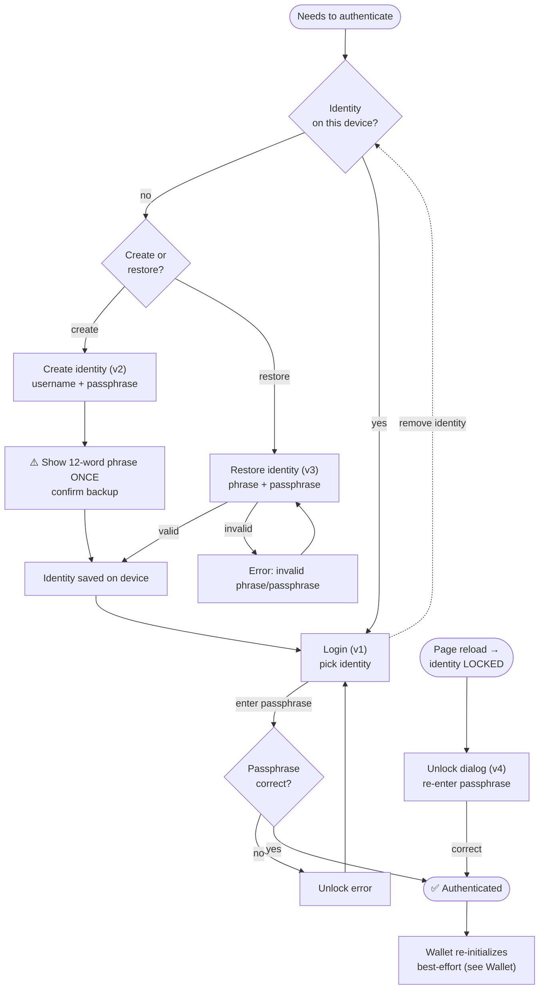

# 01 — Authentication and identity

> Domain that gives a device an identity and unlocks it. Email-less: two secrets (recovery phrase +
> passphrase), neither recoverable. See [[Product overview and principles]] §"Email-less identity".

**Actor:** anyone not authenticated (Login/Create/Restore); a user with a locked identity (Unlock).

## Views

### Login (view 1)

- **Purpose:** log in a user whose identity already exists on _this_ device.
- **Actions:** pick one of the locally saved identities; enter the passphrase to unlock it; remove an
  identity from the device; navigate to "Create" or "Restore".
- **Showable data:** list of local identities (username; optional identity indicator). The list is
  **reactive**: create/restore/remove updates it instantly.
- **Relevant states:** no identity on device (empty state → invite to create/restore); wrong
  passphrase (unlock error).
- **What's next:** successful unlock → user is authenticated.

### Create identity (view 2)

- **Purpose:** generate a new identity.
- **Actions:** enter username + passphrase (with confirmation); generate the new recovery phrase;
  **confirm having saved it**.
- **Showable data:** the **12-word recovery phrase, shown ONCE**; warnings that phrase + passphrase
  are both required and **not recoverable**.
- **Relevant states:** validation errors (username/passphrase); the critical backup step.
- **What's next:** identity registered and securely saved on the device.

> [!danger] 🎯 The most delicate moment of the whole product
> See [[Product overview and principles]]. Design it so the user **cannot** breeze past it without
> actually saving the words.

### Restore identity (view 3)

- **Purpose:** reconstruct an existing identity on a new device.
- **Actions:** enter recovery phrase + passphrase; restore.
- **Showable data:** input form; result messaging.
- **Relevant states:** invalid recovery phrase/passphrase.
- **What's next:** identity securely saved; user proceeds to login.

### Unlock identity (view 4)

- **Purpose:** restore the identity after a page reload (when "locked").
- **Actions:** re-enter the passphrase.
- **Showable data:** which identity is being unlocked; possible error.
- **What's next:** identity unlocked; the wallet re-initializes on its own, even if the wallet service
  is momentarily down (see [[06 — Wallet]]).

> [!note] 🎯 Keep it minimal
> A simple dialog asking the passphrase for the identity to unlock — nothing more elaborate.

## Flowchart

## Empty / error states to design

- No identity on device → empty state inviting create/restore.
- Wrong passphrase → inline unlock error (login and unlock).
- Invalid phrase/passphrase on restore.

---

Related: [[Personas and actors]] · [[06 — Wallet]] · [[Glossary]]
