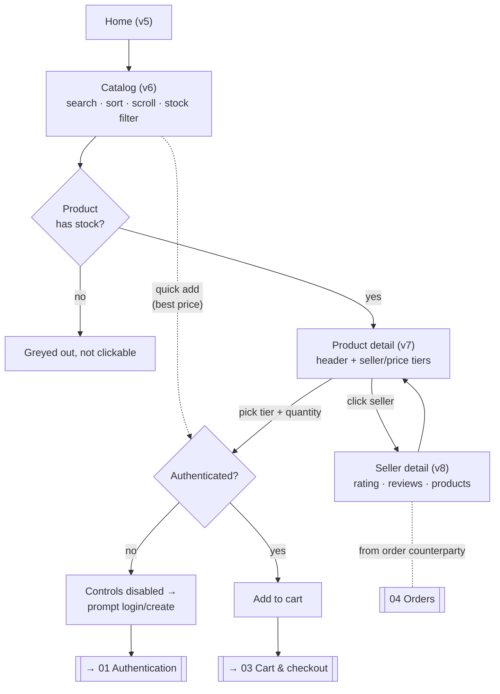

# 02 — Public storefront

> The only **public** domain (no authentication needed to browse). Buying requires logging in.

**Actor:** everyone for reading; **authenticated only** to buy.

## Views

### Home (view 5)

- **Purpose:** the product's **landing page**: present it and lead to the catalog.
- **Showable data:** presentation content and an entry point to the catalog.

### Product catalog (view 6)

- **Purpose:** browse products.
- **Actions:** search by name; sort by **name / price / rating** (asc/desc); paginate/scroll
  (incremental loading); toggle the **"show out-of-stock products too"** filter (by default only
  products with available stock are shown).
- **Showable data (per product):** name, image, rating (if any), **best available price**,
  availability. Products **without stock** are shown greyed out and are **not clickable**.
- **Relevant states:** no results (empty state); loading next pages; visual distinction between
  available and out-of-stock products.
- **What's next:** click an available product → detail.

### Product detail (view 7)

- **Purpose:** explore a product and **choose which seller to buy from**.
- **Actions:** pick a **tier (seller + price)**; set a **quantity** (min 1, max = that tier's
  availability); add to cart. The catalog "quick add" instead always buys at the **best price**.
- **Showable data:** product header (image, name, rating, description); list of **sellers and price
  tiers**, sorted by ascending price; the cheapest tier carries the **"Best price"** badge; per tier,
  the available quantity.
- **Relevant states:** product **out of stock** (dedicated message instead of the seller list);
  purchase controls **disabled** if not authenticated or sold out.
- **What's next:** add to cart → proceed to cart/checkout.

> [!tip] 🎯 One product, many sellers and prices
> Make it clear you buy from _a_ seller at _a_ price, not "from the product" in the abstract.

### Seller detail (view 8)

- **Purpose:** show a seller's **public profile** and **reputation**, to build trust before buying.
- **Actions:** review rating and reviews; navigate to the seller's products/tiers.
- **Showable data:** seller identity (username + human-readable identifier); **average rating**;
  **review list** (author, buyer/seller role, score, text, date); the products they sell.
- **Relevant states:** seller **with no reviews** (empty state, e.g. "No reviews yet"); missing rating
  → `—`.
- **How you get here:** from the seller rows of the **product detail** (view 7) and from the
  counterparty of an **order** (view 12, see [[04 — Orders, detail and chat]]).

> [!note] 🎯 Staged feature
> Relies on the **reviews/reputation** feature, today **staged but not active** (see
> [[Data and entity catalog]] §Review). Reviews are tied to a real trade (you review after an order)
> and also feed the `rating` shown on the product. Visible reputation reinforces the "trust"
> positioning — a **design opportunity**.

## Flowchart

## Empty / disabled states to design

- Catalog: no search results; out-of-stock products greyed and non-clickable.
- Product detail: out-of-stock message; purchase controls disabled when anonymous or sold out.
- Seller detail: no reviews yet; rating absent → `—`.

---

Related: [[03 — Cart and checkout]] · [[04 — Orders, detail and chat]] · [[Data and entity catalog]]
