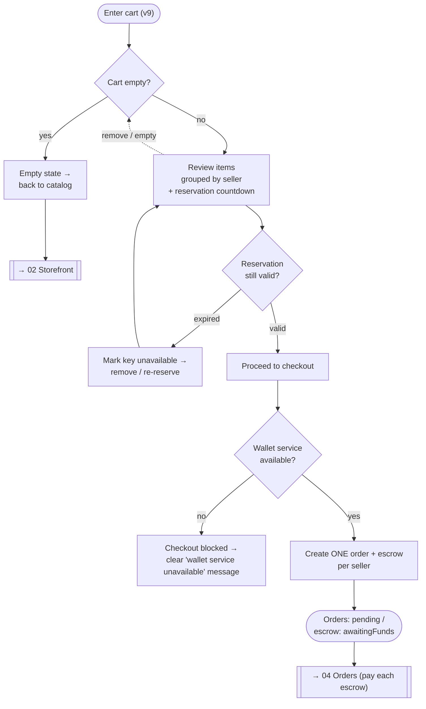

# 03 — Cart and checkout

> Where reserved keys are reviewed and the purchase starts. Reservations are time-bound (~10 min).

**Actor:** authenticated buyer.

## View — Cart / checkout (view 9)

- **Purpose:** review reserved keys and start the purchase.
- **Actions:** review reserved items; remove items / empty; proceed to checkout.
- **Showable data:** cart items (product, seller, price, quantity); total; **remaining reservation
  time** (keys are reserved for ~10 minutes).
- **Relevant states:** empty cart (empty state); **reservation expired** (a key is no longer
  available); grouping by seller.
- **What's next:** checkout creates **one order per involved seller**, each with its own escrow.
  Payment requires the wallet service up: if down, checkout isn't possible and must be communicated
  clearly (see [[06 — Wallet]]).

> [!tip] 🎯 The timed reservation is a visible time constraint
> Handle the countdown and expiry without losing data or disorienting the user. A reservation is a
> short-lived hold so two buyers can't check out the same key.

> [!important] Checkout splits by seller
> A cart with keys from 3 sellers becomes **3 orders + 3 escrows**. The design must make this fan-out
> understandable (the user pays/tracks per-seller orders afterwards — see
> [[04 — Orders, detail and chat]]).

## Flowchart

## Empty / error states to design

- Empty cart → invite back to catalog.
- Expired reservation → item flagged unavailable; offer remove/re-reserve.
- Wallet service down → checkout blocked with a dignified, explicit message (not a hard crash).

---

Related: [[02 — Public storefront]] · [[04 — Orders, detail and chat]] · [[State machine — order and escrow]] · [[06 — Wallet]]
