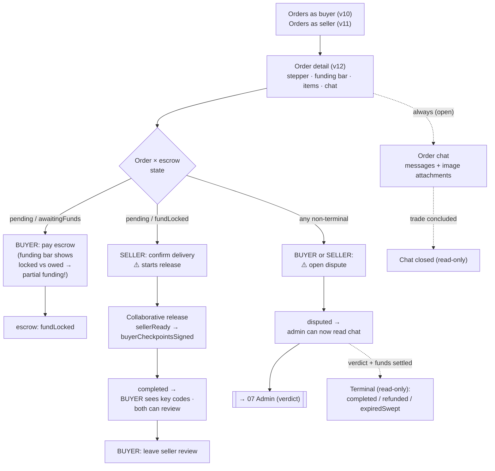

# 04 — Orders, detail and chat

> The operative heart of the app. **Order detail is "one view, many states"** — actions change by
> role + order status + escrow status. Read [[State machine — order and escrow]] first.

**Actor:** buyer and/or seller (same user can be both). Admin sees the chat only via
[[07 — Admin area and disputes]].

## Views

### Orders as buyer (view 10) / as seller (view 11)

- **Purpose:** list of one's transactions in each role.
- **Actions:** filter/sort/paginate as needed; open the detail.
- **Showable data (per order):** counterparty, total (in sats), **order status** and **funds status**
  (two distinct things — see [[State machine — order and escrow]]), date.
- **Relevant states:** no orders (distinct empty states for "haven't bought yet" / "haven't sold yet").

### Order detail (view 12)

- **Purpose:** the operative center of a single transaction.
- **Actions (depend on role and state):**
  - **Buyer:** pay the escrow; collaborate on the release; **open a dispute**; use the **order chat**;
    **view/copy the key codes** when entitled; once concluded, **leave a review** of the seller.
  - **Seller:** **confirm delivery** (starts the release); use the **order chat**; **open a dispute**.
- **Showable data:** order progress (conceptual stepper); **escrow funding bar/indicator** ("how much
  is locked" over "how much is owed" — must make the **partial funding** case obvious, see
  [[State machine — order and escrow]]); order items; total and components (fees — see
  [[Data and entity catalog]]); **key codes** (only to the entitled party, else `—`); access to the
  chat; on a concluded dispute, the **outcome** (what was refunded, favoured party).
- **Relevant states:** every order×escrow combination from [[State machine — order and escrow]]; in
  particular "awaiting payment", "awaiting seller confirmation", "release in progress", "disputed",
  "verdict awaiting execution", terminal states (read-only).

> [!tip] 🎯 The most state-dependent view of the app
> Available actions **change** with role + order status + escrow status. Design it as "one view, many
> states", not separate screens.

### Order chat — inside order detail (view 12)

> [!note] Not a standalone view
> The chat lives **inside order detail** for buyer and seller, and is also shown in the
> **dispute detail** (view 18) for the admin — see [[07 — Admin area and disputes]].

- **Purpose:** communication between parties, and evidence in a dispute.
- **Actor:** buyer and seller always; **admin only during a dispute**.
- **Actions:** write messages; **attach images** (e.g. evidence, up to 5 MB); open attachments.
- **Showable data:** message history (sender, text, time); **system messages** (automatic events,
  e.g. "dispute concluded…"); attachment thumbnails.
- **Relevant states:** chat **open** vs **closed** (once the trade is concluded you can't write —
  disable the composer); **real-time/polling** updates while open.

> [!important] 🎯 Chat is private
> The admin does **not** read it except during a dispute. Don't suggest the platform "reads everything".

### Favorites / wishlist (view 13)

- **Purpose:** let the **logged-in user** **save products** to find them again. **Not** an admin function.
- **Actions:** add/remove a product from favorites (from catalog cards and product detail); browse the
  favorites list.
- **Showable data:** saved products list (with best price and availability, like the catalog).
- **Relevant states:** no favorites (empty state → invite to explore the catalog).

> [!note] 🎯 Staged feature
> Data is staged but logic isn't wired yet (see [[Data and entity catalog]] §Favorite): **design it
> now**, wiring comes later.

## Flowchart — order detail (role × state)

## Empty / special states to design

- Empty order lists (distinct buyer vs seller).
- Partial funding: locked < owed, status stays `awaitingFunds` — surface it on the funding bar.
- Key codes: visible only to entitled buyer, else `—`.
- "Verdict issued, awaiting execution" intermediate state.
- Chat open vs closed; system messages distinct from human ones.
- No favorites yet.

---

Related: [[State machine — order and escrow]] · [[07 — Admin area and disputes]] · [[03 — Cart and checkout]] · [[Data and entity catalog]]
