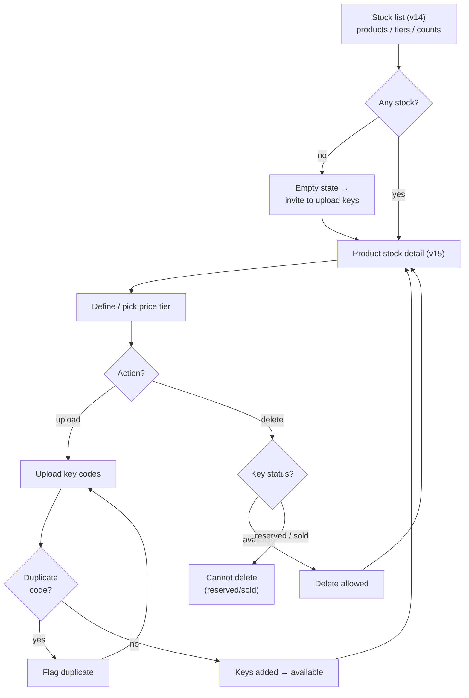

# 05 — Stock management (seller)

> The seller's inventory area: keys grouped per product and price tier.

**Actor:** seller.

## Views

### Stock list (view 14)

- **Purpose:** overview of the seller's inventory.
- **Actions:** navigate to a product to manage its keys.
- **Showable data:** per product/tier, how many keys available, the price.
- **Relevant states:** no stock (empty state → invite to upload keys).

### Product stock detail (view 15)

- **Purpose:** manage a product's keys.
- **Actions:** define a **price tier**; **upload** keys (the codes); **delete** not-yet-sold keys.
- **Showable data:** list of keys with their status (available / reserved / sold); price per tier.
- **Relevant states:** key reserved by a buyer; key already sold (not deletable); duplicate codes.

> [!warning] 🎯 Codes are sensitive data
> The codes are the good being sold. Treat them with visual caution even toward the seller.

## Flowchart

## Key status legend (within a stock)

| Status    | Meaning                          | Deletable?       |
| --------- | -------------------------------- | ---------------- |
| Available | Not reserved, not sold           | ✅               |
| Reserved  | In a buyer's cart (~10 min hold) | ⚠️ no while held |
| Sold      | Tied to an order                 | ❌               |

## Empty / error states to design

- No stock at all → invite to upload keys.
- Duplicate code on upload.
- Attempt to delete a reserved/sold key → blocked with explanation.

---

Related: [[02 — Public storefront]] · [[Data and entity catalog]] · [[Glossary]]
