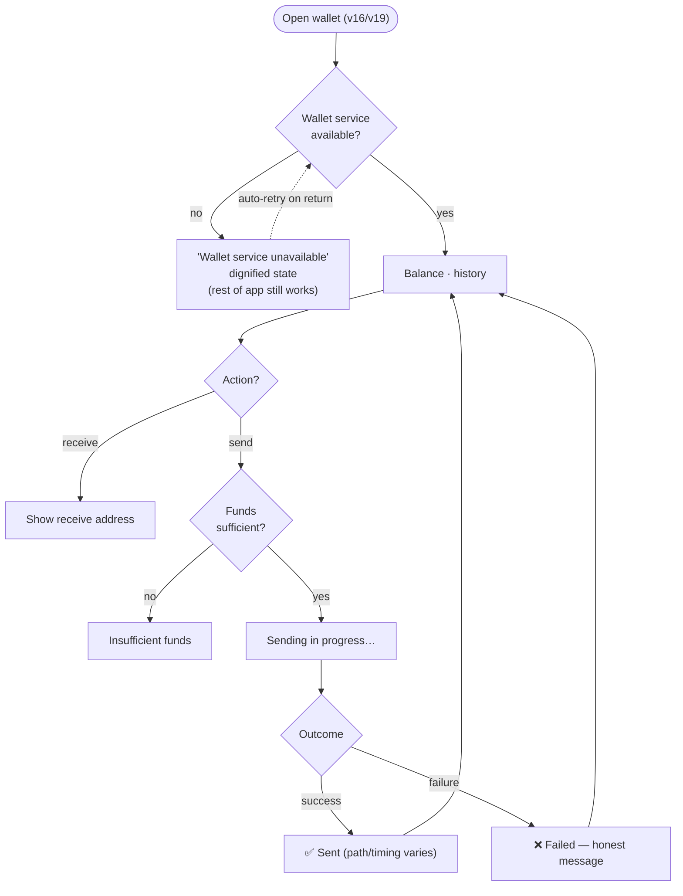

# 06 — Wallet

> Integrated wallet to receive/send funds. Same view for any authenticated user, the buyer, the
> seller, and the admin/arbiter (view 19). Depends on an **external service** that may be down.

**Actor:** any authenticated user (and the admin — see [[07 — Admin area and disputes]]).

## View — Wallet (view 16 / admin view 19)

- **Purpose:** manage the user's funds.
- **Actions:** see the balance; **receive** (show an address); **send** (to an address); browse
  transaction history.
- **Showable data:** balance; receive address; transaction history (with links to external explorers);
  outcome/type of transactions.
- **Relevant states:** **"wallet service unavailable"** (external service unreachable) — a dignified
  state, **not** a blocking error: the rest of the app keeps working; auto-recovery when the service
  returns; sending in progress; insufficient funds.

> [!important] Resilience (see [[Product overview and principles]])
> When the wallet service is down, login, orders, chat, stock and checkout still work. Only wallet
> functions are unavailable, and they recover **without re-entering the passphrase**.

> [!note] 🎯 Honest about send paths/timing
> Different sends have different paths and timings depending on the destination: feedback must be
> honest about type and timing.

> [!note] Admin wallet (view 19)
> Functionally identical. It is **also** the arbiter's wallet: arbitration shares land here. See
> [[07 — Admin area and disputes]].

## Flowchart

## States to design

- Wallet service unavailable (non-blocking) → auto-recovery.
- Sending in progress / success / failure (honest timing).
- Insufficient funds.

---

Related: [[Product overview and principles]] · [[07 — Admin area and disputes]]
