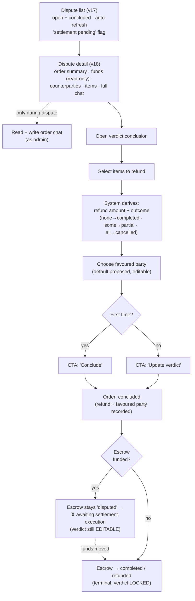

# 07 — Admin area and disputes

> Reserved area for the single platform admin, who is also the **arbiter**. A separate persona: judge,
> not buy/sell — see [[Personas and actors]]. The admin is **not omnipotent**: even as arbiter they
> can't move funds alone.

**Actor:** admin.

## Views

### Dispute list (view 17)

- **Purpose:** see the disputes to handle.
- **Actions:** scroll; open a dispute.
- **Showable data (per dispute):** id, **status**, counterparties, **total in sats**, date; a
  **"settlement pending"** flag when the order is concluded but the funds haven't moved yet.
- **Relevant states:** shows only **open** and **concluded** disputes; periodic refresh (the list
  updates on its own).

### Dispute detail (view 18)

- **Purpose:** give the admin everything needed to judge.
- **Actions:** review; open the verdict conclusion; take part in the chat.
- **Showable data:** order summary (status, total, **read-only funds indicator**); **outcome** when
  already concluded; **counterparties** (seller/buyer + metadata); **items**; full **conversation**
  (all messages: buyer, seller, admin) with thumbnails.
- **Relevant states:** active vs already concluded dispute (verdict still editable while funds aren't
  moved); chat open vs closed; periodic updates.

### Verdict conclusion / update — action inside dispute detail (view 18)

> [!note] Not a standalone view
> It's the **judging action** the admin performs **inside dispute detail** (view 18).

- **Purpose:** issue (or correct) the verdict.
- **Actions:** **select the items to refund**; the system derives the **refund amount** and the
  **outcome** (no refund → _completed_; all → _cancelled_; some → _partially refunded_); choose the
  **favoured party** (buyer/seller — there's a default proposal but it's **editable**); confirm.
- **Showable data:** items list with prices; computed refund amount; derived outcome; favoured party;
  economic breakdown (fees, arbitration share).
- **Relevant states:** **first conclusion** vs **update** of an already-issued verdict (the CTA changes
  accordingly, e.g. "Conclude" → "Update verdict"); blocked once the settlement is **terminal** (no
  longer editable).

> [!important] 🎯 Verdict is editable until the funds move
> High-impact action (moves real money). Make it understandable and well confirmed, distinguishing
> "I issue the verdict" from "the settlement is executed". See [[State machine — order and escrow]]:
> the order can be `concluded` while the escrow is still `disputed`.

### Admin wallet (view 19)

Functionally identical to the user wallet — see [[06 — Wallet]]. It is **also** the arbiter's wallet:
arbitration shares land here.

## Flowchart

## Access scope to respect

- Admin sees **only** disputes and orders they judged; **never** happy orders never disputed.
- Out-of-scope orders → explicit **"access denied"**.
- Chat is readable by admin **only during a dispute**.

## States to design

- Dispute open vs concluded; "settlement pending" flag.
- First conclusion vs update (CTA label switch).
- Verdict issued but funds not moved (editable) vs settlement terminal (locked).
- Read-only funds indicator + economic breakdown (fees, arbitration share).

---

Related: [[State machine — order and escrow]] · [[04 — Orders, detail and chat]] · [[06 — Wallet]] · [[Data and entity catalog]]
