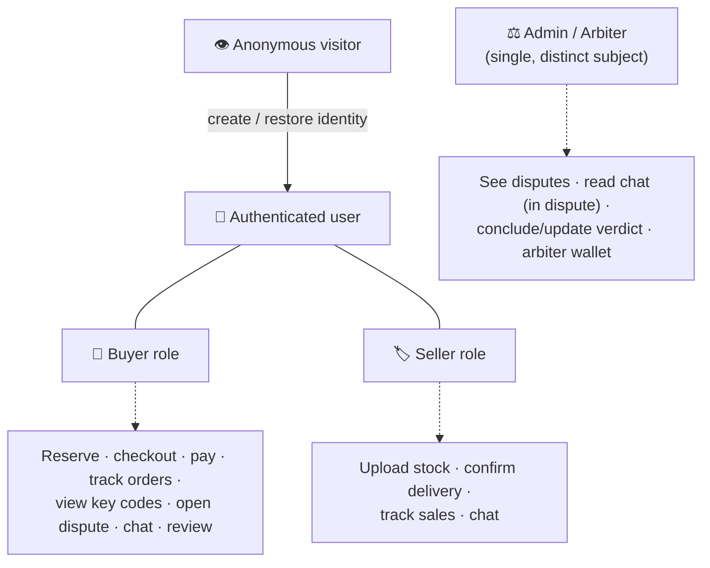

# Personas and actors

Antigone has **four actors**. Crucial note: **a single registered user can be both buyer and seller
at once** — they're roles, not different accounts. The admin instead is a single, distinct subject.

## 👁️ Anonymous visitor

- **Goal:** discover products, evaluate prices and sellers.
- **Can:** browse the catalog, search/sort products, open a product detail, see sellers and price
  tiers. **Cannot** reserve, add to cart or buy.
- **Sees:** public data only (product cards, prices, availability). Never keys, never other users' data.
- **Natural transition:** to buy, must **create an identity or log in**.

## 🛒 Buyer (authenticated)

- **Goal:** buy a license key safely and receive it.
- **Can:** reserve keys in the cart, check out (creates one or more orders + escrows), **pay** the
  escrow from their wallet, track their purchase orders, **view the key code** when entitled, **open a
  dispute**, **chat** with the seller (and the admin during a dispute), manage the wallet.
- **Sees:** own orders, each one's status, the funds state, purchased key codes (only when entitled),
  the chat, own balance.

## 🏷️ Seller (authenticated — can be the same user)

- **Goal:** sell keys and get paid.
- **Can:** **upload stock** (add keys for a product at a price tier), delete unsold keys, see own
  sales orders, **confirm delivery** (starts releasing the funds), **chat** with the buyer, manage the
  wallet.
- **Sees:** own inventory per product/price tier, own sales orders, earnings, the chat.

## ⚖️ Admin / arbiter

- **Goal:** moderate and resolve disputes neutrally.
- **Can:** see the dispute list (open and concluded), open a dispute detail, **read the chat** of the
  disputed order, **write** in the chat as admin, **conclude/update the verdict** (choose items to
  refund and the favoured party), manage own wallet (which is also the arbiter's wallet, where
  arbitration shares land).
- **Sees:** only disputes and orders they judged; **does not** see "happy" orders never disputed. For
  orders outside their scope they explicitly get "access denied".

---

See also: [[Product overview and principles]] · [[State machine — order and escrow]]
