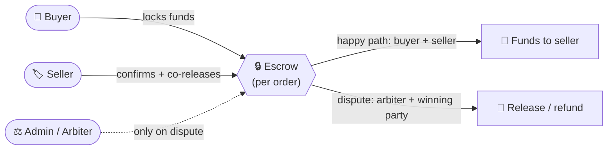

# Product overview and principles

> [!info] Read this first
> Antigone already exists as a **working prototype** but **without studied design** — the current UI
> is a bare technical scaffold. The goal is to restart the experience from scratch while keeping
> intact _what the product does_.

## What Antigone is, in one sentence

**Antigone is a marketplace for software license keys** where you **do not sign up with an email**:
access is protected by a password (the "13th word", see below). The payment stays **locked in a
trustless escrow** until the trade resolves.

## The problem it solves

A buyer and a seller who don't know each other **do not trust each other**:

- the **buyer** doesn't want to pay before receiving the license key;
- the **seller** doesn't want to hand over the key before being paid.

Antigone breaks the standoff with an **escrow**: the buyer's money is **locked** the moment they pay,
and can only leave in pre-agreed ways. The key property to communicate to the user:

> [!important] The core promise
> **No single party — not the buyer, not the seller, not the platform admin — can move the escrow
> funds alone.** The whole tone and visual language revolve around one promise: **trust without
> having to trust anyone.**

## Guiding UX principles (proposed, not imposed)

- **Convey safety and control.** The user handles real money and a **non-recoverable** identity. The
  UI must feel solid, clear, never ambiguous about "where is my money" and "what am I about to sign".
- **Make the irreversible recognizable.** Some actions cannot be undone — they must be clearly
  distinguished from reversible ones.
- **State is always legible.** At any moment the user must understand where their transaction is and
  what _they_ must do (or what they're waiting on from the other side).
- **Honesty about timing.** Some operations depend on an external network and may fail or lag: the UI
  must not lie about state.

## Domain primer

Antigone lives on two concepts the general public doesn't know: **email-less identity** and the
**escrow**. Each carries 🎯 **design implications**.

### Email-less identity: recovery phrase + passphrase

Two secrets are required for an identity:

- a **recovery phrase**: 12 words generated by the system at creation, to be stored;
- a **passphrase** chosen by the user (the "13th word"), which acts as the password.

You need **both** to log in, and **neither is recoverable** — there is no "reset password". The
recovery phrase is shown **only once**, at creation. Two ways to get an identity on a device:
**Create identity** (system generates a new phrase to save) and **Restore identity** (re-enter an
existing phrase + passphrase, e.g. on a new device). Once present, the identity stays on the device;
after a page reload the user must **re-enter the passphrase** to "unlock" it.

> [!tip] 🎯 Design implications
>
> - **Backing up the recovery phrase is the single most critical, irreversible moment of the whole
>   product.** Shown once at creation; lose it (or the passphrase) → access and any funds are **lost
>   forever**. Treat the backup moment with maximum gravity and clarity.
> - **Two distinct secrets** are needed (phrase _and_ passphrase): communicate clearly they're
>   different and both required.
> - The passphrase is re-entered after every reload → there's a **"locked identity" state** to handle
>   gracefully (see Unlock in [[01 — Authentication and identity]]).
> - **Another user's identifier** is a long, unreadable string → present it humanely (truncation,
>   derived avatar, copy-to-clipboard). Username helps but may not be unique.

### The administrator / arbiter

There is **one** platform administrator. The same subject holds **two coinciding roles**:
administrator and **arbiter** of disputes. The admin logs in like anyone else (phrase + passphrase)
but their UI has reserved areas (disputes).

> [!tip] 🎯 Design implications
>
> - The admin area is a **separate persona** with different goals (judge, not buy/sell): it deserves
>   its own language and visual hierarchy while staying coherent.
> - The admin **is not omnipotent**: even as arbiter they can't take the money alone. Don't suggest
>   "absolute power" — convey a **neutral judge** role.

### The escrow and its three roles

The **escrow** is the contract that locks the payment. Every order has **a dedicated one**, with
three roles:

| Role                | Who               | What it does in the escrow                                    |
| ------------------- | ----------------- | ------------------------------------------------------------- |
| **Buyer**           | who purchases     | pays (locks funds); collaborates on release on the happy path |
| **Seller**          | who sells the key | confirms delivery and starts releasing the funds              |
| **Admin / arbiter** | the platform      | **only on a dispute** co-signs the verdict                    |

On the normal path, buyer and seller release the funds **together**. If they fight, the **arbiter**
steps in but **still can't move the money alone**: they can only unlock funds **by agreeing with the
party ruled the winner** (both must act).

> [!tip] 🎯 Design implications
>
> - The product must **constantly show the state of the money**: still to be paid? locked? released?
>   refunded? This is probably the most important info in the whole app.
> - The roles and the "multi-signature" guarantee are the **value proposition**: make them
>   understandable and reassuring, don't hide them.

### Order chat, dispute and arbitration

Every order has a dedicated **chat** between buyer and seller: to agree, ask questions and — if
needed — exchange evidence (including attachments, e.g. screenshots). Messages are **private**:
normally only the two involved parties read them.

If something goes wrong (broken/undelivered key…), a party can **open a dispute**. The chat then
becomes visible to the admin too, who reviews and **concludes** with a verdict: decides which items
to refund and which party is **favoured** (buyer or seller). The verdict produces a **refund** (full,
partial or none) and possibly a small arbitration share for the platform.

> [!important] Verdict vs. funds moved
> **As long as the funds haven't actually moved, the verdict is editable.** The admin can "update the
> verdict" (e.g. change the favoured party) until the funds exchange is settled.

> [!tip] 🎯 Design implications
>
> - A dispute is an **emotionally charged** flow (an economic conflict). Tone: clear, neutral,
>   non-blaming.
> - There's a **difference between "verdict issued" and "funds actually moved"**: design must
>   communicate the intermediate "verdict decided, awaiting execution" state and that it's still
>   correctable.

### The wallet and temporary unavailability

Every user has an integrated **wallet** to receive and send funds. It depends on an **external
service** that **may be temporarily unreachable**.

> [!important] Resilience
> **Login, orders, chat, stock management and checkout all keep working even when the wallet service
> is down.** Only the _wallet_ functions (balance, send, receive) are unavailable and recover on
> their own when the service returns — **without re-entering the passphrase**.

> [!tip] 🎯 Design implications
>
> - Provide an explicit **"wallet service unavailable"** state — dignified and reassuring (not a
>   catastrophic error): the rest of the app keeps working.
> - Send operations can have **different outcomes and timings** depending on destination: feedback
>   must be honest.

---

See also: [[Personas and actors]] · [[State machine — order and escrow]] · [[Glossary]]
