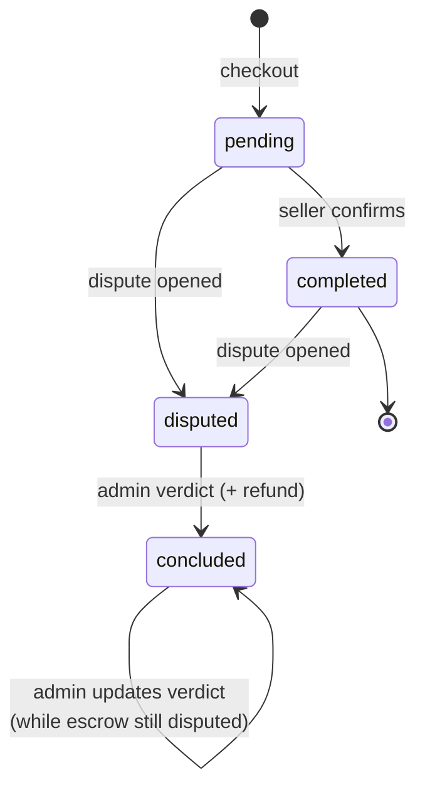
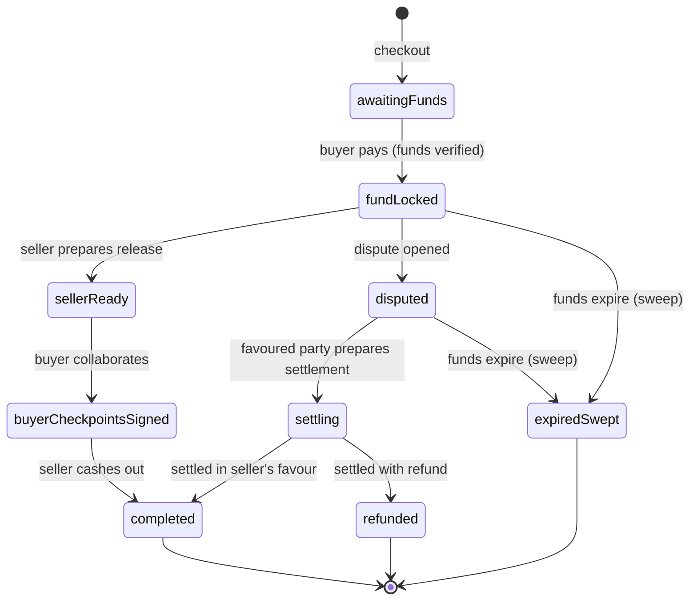

# State machine — order and escrow

> [!important] The backbone
> If the design team reads one note, read this. Every order is tracked by **two records that advance
> in parallel but are not the same thing.**

## Two records in parallel

- The **order** is the transaction **as the user sees it** (pending, completed, disputed…).
- The **escrow** is **where the money actually is** (awaiting funds, locked, released, refunded…).

They're separate because the two planes can **diverge**: an order can be `concluded` (admin issued the
verdict) while its escrow is still `disputed` (funds not yet moved). **When the user asks "where is my
money?", the answer is the escrow status, not the order status.** Design must make both planes legible
without conflating them.

## Order states (the "user" plane)

Values: `pending` · `completed` · `disputed` · `concluded` (plus `funded`, `refunded`, `cancelled`
which exist in the data model but are **no longer used** — see warning).

| Order status | What it means to the user                                                                                   |
| ------------ | ----------------------------------------------------------------------------------------------------------- |
| `pending`    | Order created at checkout. Usually waiting for the buyer to pay and/or the seller to confirm.               |
| `completed`  | Seller confirmed delivery; the trade is going well.                                                         |
| `disputed`   | One party opened a claim; arbitration is in progress.                                                       |
| `concluded`  | Admin issued a verdict. **Not necessarily terminal**: while funds aren't moved, the verdict can be updated. |

> [!warning] Residual states
> `funded`, `refunded`, `cancelled` exist in the enum but are **not used** at order level (funding is
> tracked on the escrow). **Do not represent them** as order states in the prototype.

## Escrow states (the "money" plane)

Values: `awaitingFunds` · `fundLocked` · `sellerReady` · `buyerCheckpointsSigned` · `completed` ·
`disputed` · `settling` · `refunded` · `expiredSwept`.

| Escrow status                            | "Where the money is"                                                                                                                                                      |
| ---------------------------------------- | ------------------------------------------------------------------------------------------------------------------------------------------------------------------------- |
| `awaitingFunds`                          | Escrow created, **awaiting payment**. Stays so until the deposit covers the **full amount**: a **partial** payment does not advance the state (see partial-funding note). |
| `fundLocked`                             | Funds **locked** in the escrow. From here the release — or, if needed, the dispute — starts.                                                                              |
| `sellerReady` / `buyerCheckpointsSigned` | **Intermediate states of the collaborative release** (seller and buyer completing the trade together).                                                                    |
| `completed`                              | Funds **released** to their final destination (usually the seller). Terminal.                                                                                             |
| `disputed`                               | Funds locked **under contest**; awaiting settlement after the verdict.                                                                                                    |
| `settling`                               | The verdict settlement is **in progress**.                                                                                                                                |
| `refunded`                               | Escrow closed **with refund** (full or partial) to the buyer. Terminal.                                                                                                   |
| `expiredSwept`                           | Funds **expired** and no longer recoverable (exceptional: trade didn't resolve in time). Terminal.                                                                        |

> [!warning] Residual states
> `partiallyFunded` and `buyerSubmitted` exist in the enum but real transitions never set them: **do
> not represent them** as states in the prototype.

> [!danger] 💸 Partial funding (a real case to make clear)
> The buyer can deposit **less than the total** owed: if the order costs 100k sats but the wallet has
> 50k, they can still pay what they have. Those funds stay locked, but the escrow is **not fully
> funded** and the status **stays `awaitingFunds`** (no `partiallyFunded` state tracks it). Since the
> logic doesn't distinguish it, **the UI must**: clearly show **how much was deposited and how much is
> missing** to complete the escrow, so the user understands the payment isn't done. See the funding
> indicator in [[04 — Orders, detail and chat]] and [[07 — Admin area and disputes]].

## Order ↔ escrow mapping (alignment at key moments)

| Moment                                | Order status | Escrow status                          |
| ------------------------------------- | ------------ | -------------------------------------- |
| Checkout                              | `pending`    | `awaitingFunds`                        |
| Buyer has paid                        | `pending`    | `fundLocked`                           |
| Seller confirms                       | `completed`  | `fundLocked` → (release) → `completed` |
| Dispute opened                        | `disputed`   | `disputed`                             |
| Dispute concluded (escrow funded)     | `concluded`  | stays `disputed` until funds are moved |
| Dispute concluded (escrow not funded) | `concluded`  | `completed` / `refunded` directly      |

> [!tip] 🎯 Design implications (for the whole state machine)
>
> - Provide an **order progress indicator** (a conceptual "stepper", however rendered) showing **where
>   we are** and **whose move is next**.
> - The **funds state** must be distinguishable from the order state: two pieces of info, not one.
> - **Partial funding** has no dedicated state but is real: the UI must show **how much is locked and
>   how much is missing**.
> - The "verdict issued but funds not yet moved" case is real and must be communicated (e.g. "awaiting
>   settlement execution").
> - Terminal states (`completed`, `refunded`, `expiredSwept`) close the trade: design may treat them
>   as "archive" / read-only.

---

See also: [[Glossary]] · [[04 — Orders, detail and chat]] · [[07 — Admin area and disputes]]
