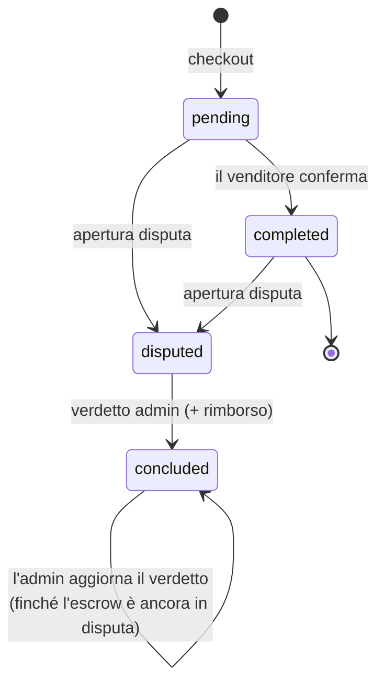
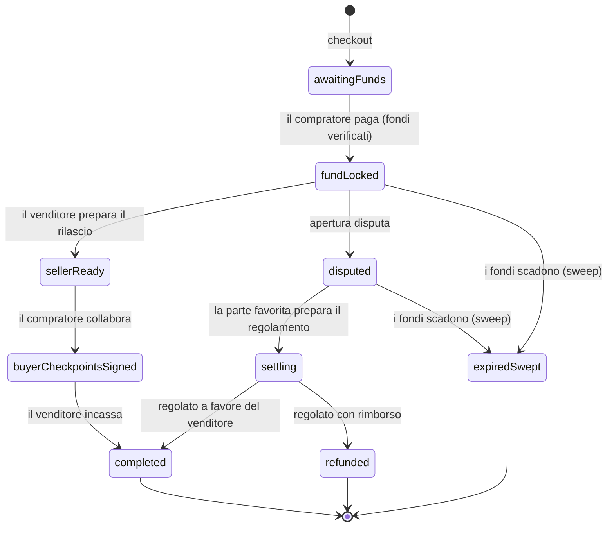

# Antigone — Report di requisiti per il team di Design

---

## Indice

1. [Introduzione e scopo](#1-introduzione-e-scopo)
2. [Panorama del prodotto](#2-panorama-del-prodotto)
3. [Primer di dominio per designer](#3-primer-di-dominio-per-designer)
4. [Personas / attori](#4-personas--attori)
5. [State machine degli ordini](#5-state-machine-degli-ordini)
6. [Inventario delle viste (sitemap logica)](#6-inventario-delle-viste-sitemap-logica)
7. [Specifiche per area funzionale](#7-specifiche-per-area-funzionale)
8. [Requisiti trasversali](#8-requisiti-trasversali)
9. [Appendice — Catalogo dati ed entità](#9-appendice--catalogo-dati-ed-entità)

---

## 1. Introduzione e scopo

### 1.1 A chi è rivolto

A chi progetterà l'esperienza utente e l'interfaccia di Antigone. Il prodotto esiste già come
prototipo **funzionante** ma **senza un design studiato**: l'interfaccia attuale è una semplice
impalcatura tecnica. L'obiettivo è ripartire da zero sul piano dell'esperienza, mantenendo intatto
ciò che il prodotto _fa_.

### 1.2 Come leggere il documento

- I sezione 2–sezione 5 sono **fondamenta condivise**: leggeteli per primi. Spiegano cos'è il prodotto, il
  vocabolario di dominio, gli attori e — soprattutto — la **macchina a stati** che governa l'intero
  ciclo di vita di una transazione. Senza questa base molte schermate risultano incomprensibili.
- Il sezione 6 è la **checklist delle viste** da prototipare.
- Il sezione 7 è il **corpo operativo**: per ogni vista, scopo, attore, azioni, dati, stati.
- Il sezione 8 raccoglie i **requisiti trasversali** (responsive, accessibilità, feedback).
- Il sezione 9 è il **catalogo dati**: quali informazioni esistono, cosa significano, quali sono mostrabili
  all'utente e quali sono idraulica interna da non mostrare mai.

---

## 2. Panorama del prodotto

### 2.1 Cos'è Antigone, in una frase

**Antigone è un marketplace di chiavi di licenza software** in cui **non ci si registra con
un'email**: l'accesso è protetto da una password (la «13ª parola», vedi sezione 3.1). Il pagamento
resta bloccato in una **garanzia (escrow) senza fiducia** finché lo scambio non si risolve.

### 2.2 Il problema che risolve

Un compratore e un venditore che non si conoscono **non si fidano l'uno dell'altro**:

- il **compratore** non vuole pagare prima di ricevere la chiave di licenza;
- il **venditore** non vuole consegnare la chiave prima di essere pagato.

Antigone rompe lo stallo con un **escrow**: il denaro del compratore viene **bloccato** nel momento
in cui paga, e può uscire solo in modi prestabiliti e concordati. La proprietà chiave da comunicare
all'utente è:

> **Nessuna singola parte — né il compratore, né il venditore, né l'amministratore della
> piattaforma — può muovere i fondi della garanzia da sola.**

Tutto il tono e la grafica del prodotto ruotano attorno a una promessa: **fiducia senza doversi
fidare di nessuno**.

### 2.3 Principi UX guida (proposti, non imposti)

Sono direzioni di tono, non soluzioni:

- **Trasmettere sicurezza e controllo.** L'utente maneggia denaro reale e una identità **non
  recuperabile**. L'interfaccia deve risultare solida, chiara, mai ambigua sul
  «dove sono i miei soldi» e «cosa sto per firmare».
- **Rendere l'irreversibile riconoscibile.** Alcune azioni non si possono annullare (vedi sezione 3 e sezione 8):
  vanno distinte chiaramente dalle azioni reversibili.
- **Lo stato è sempre leggibile.** In ogni momento l'utente deve poter capire a che punto è la sua
  transazione e cosa deve fare lui (o cosa sta aspettando dall'altra parte).
- **Onestà sui tempi.** Alcune operazioni dipendono da una rete esterna (vedi sezione 3.5) e possono
  fallire o ritardare: l'interfaccia non deve mentire sullo stato.

---

## 3. Primer di dominio per designer

Antigone vive su due concetti che il pubblico generalista non conosce: **l'identità senza email** e
**l'escrow** (garanzia). Questa sezione li spiega in linguaggio semplice. Ogni concetto chiave ha un
box **🎯 Implicazioni di design** con le ricadute concrete.

### 3.1 Identità senza email: frase di recupero + passphrase

In Antigone **non ci si registra con un'email**. Per avere un'identità servono due segreti:

- una **frase di recupero**: 12 parole generate dal sistema alla creazione, da conservare;
- una **passphrase** scelta dall'utente (la «13ª parola»), che funge da password.

Servono **entrambe** per accedere, e **nessuna delle due è recuperabile**: non esiste alcun
«recupera password». La frase di recupero viene mostrata **una sola volta**, alla creazione.

Ci sono quindi **due modi** per avere un'identità sul dispositivo:

- **Crea identità** — il sistema genera una nuova frase di recupero da salvare (vista 2, sezione 7.1).
- **Ripristina identità** — l'utente reinserisce una frase di recupero + passphrase già esistenti
  per ricostruire la propria identità (ad es. su un nuovo dispositivo). È a questo che serve la
  frase di recupero (vista 3, sezione 7.1).

Una volta presente sul dispositivo, l'identità vi resta salvata. Dopo un ricaricamento della pagina
l'utente deve **re-inserire la passphrase** per «sbloccare» l'identità e tornare operativo.

> **🎯 Implicazioni di design**
>
> - **Il backup della frase di recupero è il momento più critico e irreversibile dell'intero
>   prodotto.** Le 12 parole vengono mostrate **una sola volta** alla creazione. Se l'utente le
>   perde — o perde la passphrase — **l'accesso e gli eventuali fondi sono persi per sempre**.
>   Nessun «recupera password» è possibile. Il momento del backup va trattato con la massima gravità
>   e chiarezza.
> - Servono **due segreti distinti**: frase di recupero _e_ passphrase. Bisogna comunicare bene che
>   sono due cose diverse ed entrambe necessarie.
> - La passphrase va re-inserita dopo ogni ricaricamento → c'è uno **stato di «identità bloccata»**
>   da gestire con grazia (vedi vista _Unlock_, sezione 7.1).
> - L'**identificatore di un altro utente** (venditore, controparte) è una stringa lunga e
>   illeggibile. Va presentato in modo umano (troncamento, eventuale avatar derivato,
>   copia-negli-appunti). Lo username aiuta ma può non essere univoco.

### 3.2 L'amministratore / arbitro

Esiste **un** amministratore di piattaforma. Lo stesso soggetto ricopre **due ruoli che
coincidono**: amministratore e **arbitro** delle dispute. L'admin accede come chiunque altro (frase
di recupero + passphrase), ma la sua interfaccia ha aree riservate (le dispute).

> **🎯 Implicazioni di design**
>
> - L'area admin è una **persona separata** con obiettivi diversi (giudicare, non comprare/vendere):
>   merita un linguaggio e una gerarchia visiva propri, pur restando coerente col resto.
> - L'admin **non è onnipotente**: anche da arbitro non può prendere i soldi da solo. Il design non
>   deve suggerire un «potere assoluto» ma un ruolo di **giudice neutrale**.

### 3.3 L'escrow (garanzia) e i suoi tre ruoli

L'**escrow** è il contratto che blocca il pagamento. Ogni ordine ne ha **uno dedicato**. Vi
partecipano tre ruoli:

| Ruolo               | Chi è               | Cosa fa nella garanzia                                           |
| ------------------- | ------------------- | ---------------------------------------------------------------- |
| **Compratore**      | chi acquista        | paga (blocca i fondi); collabora al rilascio sul percorso felice |
| **Venditore**       | chi vende la chiave | conferma la consegna e avvia il rilascio dei fondi               |
| **Admin / arbitro** | la piattaforma      | **solo in caso di disputa** co-firma il verdetto                 |

Sul percorso normale, compratore e venditore rilasciano i fondi **insieme**. Se litigano,
interviene l'**arbitro**, che però **non può comunque muovere il denaro da solo**: può sbloccare i
fondi **solo accordandosi con la parte che ha giudicato vincitrice** (serve l'azione di entrambi).

> **🎯 Implicazioni di design**
>
> - Il prodotto deve **mostrare costantemente lo stato del denaro**: è ancora da pagare? è bloccato?
>   è stato rilasciato? rimborsato? Questa è probabilmente l'informazione più importante di tutta
>   l'app.
> - I ruoli e la garanzia «multi-firma» sono la **proposta di valore**: vale la pena renderli
>   comprensibili e rassicuranti, non nasconderli del tutto.

### 3.4 La chat dell'ordine, la disputa e l'arbitraggio

Ogni ordine ha una **chat** dedicata tra compratore e venditore: serve ad accordarsi, chiedere
chiarimenti e — se serve — scambiarsi prove (anche allegati, es. screenshot). I messaggi sono
**privati**: di norma li leggono solo le due parti coinvolte.

Se qualcosa va storto (chiave non funzionante, non consegnata…), una parte può **aprire una disputa**.
A quel punto la chat dell'ordine diventa visibile anche all'admin, che esamina e **conclude** con un
verdetto: decide quali articoli rimborsare e quale parte è **favorita** (compratore o venditore). Il
verdetto produce un **rimborso** (totale, parziale o nullo) e, eventualmente, una piccola quota di
arbitraggio per la piattaforma.

Particolarità importante: **finché i fondi non sono effettivamente mossi, il verdetto è
modificabile**. L'admin può «aggiornare il verdetto» (ad es. cambiare la parte favorita) finché lo
scambio dei fondi non è concluso.

> **🎯 Implicazioni di design**
>
> - La disputa è un **flusso emotivamente carico** (un conflitto economico). Tono chiaro, neutrale,
>   non colpevolizzante.
> - Esiste una **differenza tra «verdetto emesso» e «fondi effettivamente mossi»**: il design deve
>   saper comunicare lo stato intermedio «verdetto deciso, in attesa che venga eseguito», e il fatto
>   che è ancora correggibile.

### 3.5 Il wallet e l'indisponibilità temporanea

Ogni utente ha un **wallet** integrato per ricevere e inviare fondi. Il wallet dipende da un
**servizio esterno** che **può essere temporaneamente irraggiungibile**.

Punto cruciale di resilienza: **login, ordini, chat, gestione stock e checkout funzionano anche
quando il servizio del wallet è giù.** Solo le funzioni _del wallet_ (saldo, invio, ricezione)
restano indisponibili e si riprendono da sole quando il servizio torna, **senza dover re-inserire
la passphrase**.

> **🎯 Implicazioni di design**
>
> - Serve uno **stato esplicito «servizio wallet non disponibile»** dignitoso e rassicurante (non un
>   errore catastrofico): le altre parti dell'app continuano a funzionare.
> - Le operazioni di invio fondi possono avere esiti e **tempi diversi** a seconda della
>   destinazione: il feedback deve esserne onesto.

### 3.6 Vocabolario rapido

| Termine                     | In una frase                                                                                                                                        |
| --------------------------- | --------------------------------------------------------------------------------------------------------------------------------------------------- |
| **Chiave di licenza (key)** | Il bene venduto: un codice di licenza di un prodotto software, con un prezzo in satoshi. È il «prodotto fisico» dello scambio.                      |
| **Prodotto (product)**      | La scheda catalogo (nome, descrizione, immagine) sotto cui più venditori vendono le proprie chiavi.                                                 |
| **Stock**                   | L'inventario di **un** venditore per **un** prodotto a **un** dato prezzo. La stessa scheda prodotto può avere più venditori e più fasce di prezzo. |
| **Ordine (order)**          | La transazione come la vede l'utente (in attesa, completata, in disputa…).                                                                          |
| **Escrow (garanzia)**       | Dove sono _davvero_ i soldi (in attesa di fondi, bloccati, rilasciati, rimborsati…). Vedi sezione 5: ordine ed escrow sono **due cose distinte**.   |
| **Satoshi (sat)**           | L'unità di tutti i prezzi: intero, senza decimali.                                                                                                  |
| **Riserva (reservation)**   | Un blocco temporaneo (10 minuti) che il compratore mette su una chiave mentre è nel carrello, così due persone non comprano la stessa chiave.       |
| **Disputa**                 | La procedura di reclamo che porta all'arbitraggio dell'admin.                                                                                       |
| **Passphrase / 13ª parola** | Il segreto scelto dall'utente: funge da password e, insieme alla frase di recupero, dà accesso all'identità. Necessario al login e per sbloccarla.  |

---

## 4. Personas / attori

Antigone ha **quattro attori**. Nota fondamentale: **un singolo utente registrato può essere
contemporaneamente compratore e venditore** — sono ruoli, non account diversi. L'admin invece è un
soggetto unico e distinto.

### 4.1 Visitatore anonimo

- **Obiettivo:** scoprire i prodotti, valutare prezzi e venditori.
- **Può fare:** sfogliare il catalogo, cercare/ordinare i prodotti, aprire il dettaglio di un
  prodotto, vedere i venditori e le fasce di prezzo. **Non** può riservare, mettere nel carrello o
  acquistare.
- **Vede:** solo dati pubblici (schede prodotto, prezzi, disponibilità). Mai chiavi, mai dati di
  altri utenti.
- **Transizione naturale:** per acquistare deve **creare un'identità o accedere**.

### 4.2 Compratore (autenticato)

- **Obiettivo:** acquistare una chiave di licenza in sicurezza e riceverla.
- **Può fare:** riservare chiavi nel carrello, fare checkout (che crea uno o più ordini + relative
  garanzie), **pagare** la garanzia dal proprio wallet, seguire i propri ordini d'acquisto,
  **visualizzare il codice della chiave** quando ne ha diritto, **aprire una disputa**, **chattare**
  col venditore (e con l'admin in disputa), gestire il wallet.
- **Vede:** i propri ordini, lo stato di ciascuno, lo stato dei fondi, i codici delle chiavi
  acquistate (solo quando spettano), la chat, il proprio saldo.

### 4.3 Venditore (autenticato — può essere lo stesso utente)

- **Obiettivo:** vendere chiavi e incassare.
- **Può fare:** **caricare stock** (inserire chiavi per un prodotto a una data fascia di prezzo),
  eliminare chiavi non vendute, vedere i propri ordini di vendita, **confermare la consegna**
  (passo che avvia il rilascio dei fondi), **chattare** col compratore, gestire il wallet.
- **Vede:** il proprio inventario per prodotto/fascia di prezzo, i propri ordini di vendita, gli
  incassi, la chat.

### 4.4 Admin / arbitro

- **Obiettivo:** moderare e risolvere le dispute in modo neutrale.
- **Può fare:** vedere la lista delle dispute (aperte e concluse), aprire il dettaglio di una
  disputa, **leggere la chat** dell'ordine in disputa, **scrivere** nella chat come admin,
  **concludere/aggiornare il verdetto** (scegliere articoli da rimborsare e parte favorita),
  gestire il proprio wallet (che è anche quello dell'arbitro, dove arrivano le quote di
  arbitraggio).
- **Vede:** solo le dispute e gli ordini che ha giudicato; **non** vede gli ordini «felici» mai
  finiti in disputa. Per gli ordini fuori dal suo perimetro riceve esplicitamente «accesso negato».

---

## 5. State machine degli ordini

> Questa è la **spina dorsale del prodotto**. Se il design team legge una sola sezione, legga questa.

### 5.1 Due record che avanzano in parallelo

Ogni scambio è tracciato da **due** record che evolvono insieme ma **non sono la stessa cosa**:

- l'**ordine** è la transazione **come la vede l'utente** (in attesa, completato, in disputa…);
- l'**escrow** è **dove sono davvero i soldi** (in attesa di fondi, bloccati, rilasciati,
  rimborsati…).

Sono separati perché i due piani possono **divergere**: un ordine può essere `concluso` (l'admin ha
emesso il verdetto) mentre la sua garanzia è ancora `in disputa` (i fondi non sono ancora stati
mossi). **Quando l'utente si chiede «dove sono i miei soldi?», la risposta è nello stato
dell'escrow, non in quello dell'ordine.** Il design deve rendere entrambi i piani leggibili senza
confonderli.

### 5.2 Stati dell'ordine (piano «utente»)

Valori possibili: `pending` · `completed` · `disputed` · `concluded` (più `funded`, `refunded`,
`cancelled` che esistono nel modello dati ma **non sono più usati** — vedi nota).

Significato per l'utente:

| Stato ordine | Cosa significa per l'utente                                                                                                           |
| ------------ | ------------------------------------------------------------------------------------------------------------------------------------- |
| `pending`    | Ordine creato al checkout. In genere in attesa che il compratore paghi e/o che il venditore confermi.                                 |
| `completed`  | Il venditore ha confermato la consegna; lo scambio sta andando a buon fine.                                                           |
| `disputed`   | Una delle parti ha aperto un reclamo; è in corso l'arbitraggio.                                                                       |
| `concluded`  | L'admin ha emesso un verdetto. **Non è necessariamente terminale**: finché i fondi non sono mossi, il verdetto può essere aggiornato. |

> **⚠️ Stati residui.** `funded`, `refunded`, `cancelled` esistono nell'enum ma **non sono usati** a
> livello di ordine: il finanziamento è tracciato sull'escrow. **Non vanno rappresentati** come
> stati dell'ordine nel prototipo.

### 5.3 Stati dell'escrow (piano «denaro»)

Valori usati: `awaitingFunds` · `fundLocked` · `sellerReady` · `buyerCheckpointsSigned` ·
`completed` · `disputed` · `settling` · `refunded` · `expiredSwept`.

Significato per l'utente:

| Stato escrow                             | «Dove sono i soldi»                                                                                                                                                                                                                            |
| ---------------------------------------- | ---------------------------------------------------------------------------------------------------------------------------------------------------------------------------------------------------------------------------------------------- |
| `awaitingFunds`                          | Garanzia creata, **in attesa del pagamento** del compratore. Resta tale finché il versato non copre l'**intero importo**: un pagamento **parziale** (versato < totale) non fa avanzare lo stato (vedi nota sul finanziamento parziale, sotto). |
| `fundLocked`                             | Fondi **bloccati** nella garanzia. Da qui parte il rilascio o, se serve, la disputa.                                                                                                                                                           |
| `sellerReady` / `buyerCheckpointsSigned` | Stati **intermedi del rilascio collaborativo** (venditore e compratore stanno completando lo scambio insieme).                                                                                                                                 |
| `completed`                              | Fondi **rilasciati** alla loro destinazione finale (in genere il venditore). Terminale.                                                                                                                                                        |
| `disputed`                               | Fondi bloccati **in contestazione**; in attesa di regolamento dopo il verdetto.                                                                                                                                                                |
| `settling`                               | Il regolamento del verdetto è **in corso**.                                                                                                                                                                                                    |
| `refunded`                               | Garanzia chiusa **con rimborso** (totale o parziale) al compratore. Terminale.                                                                                                                                                                 |
| `expiredSwept`                           | I fondi sono **scaduti** e non più recuperabili (caso eccezionale: lo scambio non si è risolto in tempo). Terminale.                                                                                                                           |

> **⚠️ Stati residui.** `partiallyFunded` e `buyerSubmitted` esistono nell'enum ma le transizioni
> reali non li impostano: come **valori di stato non vanno rappresentati** nel prototipo.

> **💸 Finanziamento parziale (caso reale da rendere chiaro).** Il compratore può versare **meno
> del totale** dovuto: se l'ordine costa 100k sats ma nel wallet ce ne sono 50k, può comunque pagare
> ciò che ha. Quei fondi restano bloccati nella garanzia, ma l'escrow **non è completamente
> finanziato** e lo stato **resta `awaitingFunds`** (non c'è uno stato `partiallyFunded` che lo
> tracci). Poiché la logica non lo distingue, **deve farlo la UI**: va mostrato chiaramente **quanto
> è stato versato e quanto manca** per completare la garanzia, così l'utente capisce che il
> pagamento non è concluso (vedi l'indicatore di finanziamento, viste 12 e 18).

### 5.4 Mappatura ordine ↔ escrow (allineamento ai momenti chiave)

| Momento                                  | Stato ordine | Stato escrow                                   |
| ---------------------------------------- | ------------ | ---------------------------------------------- |
| Checkout                                 | `pending`    | `awaitingFunds`                                |
| Compratore ha pagato                     | `pending`    | `fundLocked`                                   |
| Venditore conferma                       | `completed`  | `fundLocked` → (rilascio) → `completed`        |
| Disputa aperta                           | `disputed`   | `disputed`                                     |
| Disputa conclusa (escrow finanziato)     | `concluded`  | resta `disputed` finché i fondi non sono mossi |
| Disputa conclusa (escrow non finanziato) | `concluded`  | `completed` / `refunded` direttamente          |

> **🎯 Implicazioni di design (per tutta la sezione 5)**
>
> - Serve un **indicatore di avanzamento** dell'ordine (uno «stepper» concettuale, comunque lo si
>   voglia rendere) che mostri **a che punto siamo** e **di chi è la prossima mossa**.
> - Lo **stato dei fondi** dev'essere distinguibile dallo stato dell'ordine: sono due informazioni,
>   non una.
> - Il **finanziamento parziale** (versato < totale) non ha uno stato dedicato ma è reale: la UI deve
>   mostrare **quanto è bloccato e quanto manca** per completare il pagamento della garanzia.
> - Il caso «verdetto emesso ma fondi non ancora mossi» è reale e va comunicato (es. «in attesa che
>   il regolamento venga eseguito»).
> - Gli stati terminali (`completed`, `refunded`, `expiredSwept`) chiudono lo scambio: il design può
>   trattarli come «archivio» / sola lettura.

---

## 6. Inventario delle viste (sitemap logica)

Elenco delle **viste logiche** da prototipare. È un inventario di _contenuto e funzione_: **non
impone** quante schermate fisiche creare né come strutturarle — quello lo decide il design. Serve
come **checklist di completezza**.

### Area: Autenticazione & identità

1. **Login** — selezione dell'identità presente sul dispositivo e sblocco via passphrase.
2. **Crea identità** — generazione nuova identità + backup (una sola volta) della frase di recupero.
3. **Ripristina identità** — ricostruzione da frase di recupero + passphrase.
4. **Sblocco identità (unlock)** — re-inserimento passphrase dopo un ricaricamento. Niente di
   complesso: un semplice dialog che chiede la passphrase per l'utente da sbloccare.

### Area: Storefront pubblico

5. **Home** — landing page pubblica del prodotto (presentazione + ingresso al catalogo).
6. **Catalogo prodotti** — lista con ricerca, ordinamento, paginazione/scroll, filtro disponibilità.
7. **Dettaglio prodotto** — scheda con i venditori e le fasce di prezzo, con acquisto per fascia.
8. **Dettaglio venditore** — profilo pubblico di un venditore: rating, recensioni, prodotti in
   vendita. _(Si appoggia alla feature recensioni/reputazione, oggi predisposta — vedi sezione 9.9.)_

### Area: Account — Compratore & Venditore

9. **Carrello** — chiavi riservate, modifica/svuota, avvio del checkout.
10. **Ordini come compratore** — lista degli acquisti.
11. **Ordini come venditore** — lista delle vendite.
12. **Dettaglio ordine** — stato, avanzamento, fondi, azioni di ruolo, codici chiave (se spettano),
    **chat dell'ordine** integrata e — a scambio concluso — la possibilità di lasciare una recensione.
13. **Preferiti / wishlist** — i prodotti salvati dall'utente loggato.
14. **Gestione stock** — inventario del venditore per prodotto/fascia di prezzo.
15. **Dettaglio stock di un prodotto** — caricamento/eliminazione delle chiavi.
16. **Wallet** — saldo, invio, ricezione, storico.

### Area: Admin

17. **Lista dispute** — dispute aperte e concluse.
18. **Dettaglio disputa** — quadro completo: ordine, controparti, articoli, conversazione e
    **conclusione/aggiornamento del verdetto** (selezione articoli da rimborsare + parte favorita).
19. **Wallet admin** — il wallet dell'arbitro (stessa funzione della vista 16).

### Note sulle feature «predisposte»

Due feature hanno **già il modello dati** ma **non sono ancora cablate nel codice** (la logica
arriverà dopo): vanno comunque **progettate ora**, sono parte del prototipo.

- **Preferiti / wishlist** (vista 13) — salvare prodotti nell'area dell'**utente loggato** (non è una
  funzione admin).
- **Recensioni & rating dei venditori** — alimentano il **Dettaglio venditore** (vista 8) e si
  lasciano dal **dettaglio ordine** (vista 12) dopo uno scambio reale; concorrono anche al `rating`
  mostrato sul prodotto.

I dati che le supportano esistono già (sezione 9).

---

## 7. Specifiche per area funzionale

Per ogni vista: **Scopo · Attore · Azioni possibili · Dati mostrabili · Stati rilevanti · Cosa
succede dopo**. Ricordate: niente prescrizioni di layout/interazione.

### 7.1 Autenticazione & identità

#### Login (vista 1)

- **Scopo:** far accedere un utente la cui identità è già stata creata su _questo_ dispositivo.
- **Attore:** chiunque non autenticato.
- **Azioni:** scegliere una delle identità salvate localmente; inserire la passphrase per
  sbloccarla; rimuovere un'identità dal dispositivo; navigare verso «Crea» o «Ripristina».
- **Dati mostrabili:** elenco delle identità locali (username; eventuale indicatore di identità).
  La lista è **reattiva**: creare/ripristinare/rimuovere la aggiorna all'istante.
- **Stati rilevanti:** nessuna identità sul dispositivo (stato vuoto → invito a creare/ripristinare);
  passphrase errata (errore di sblocco).
- **Cosa succede dopo:** sblocco riuscito → l'utente è autenticato.

#### Crea identità (vista 2)

- **Scopo:** generare una nuova identità.
- **Attore:** chiunque non autenticato.
- **Azioni:** inserire username + passphrase (con conferma); generare la nuova frase di recupero;
  **confermare di averla salvata**.
- **Dati mostrabili:** la **frase di recupero di 12 parole, mostrata UNA SOLA VOLTA**; avvisi sul
  fatto che frase di recupero + passphrase sono entrambe necessarie e **non recuperabili**.
- **Stati rilevanti:** errori di validazione (username/passphrase); il passaggio critico di backup.
- **Cosa succede dopo:** identità registrata e salvata in modo sicuro sul dispositivo.
- **🎯 Nota:** questo è **il momento più delicato del prodotto** (vedi sezione 3.1). Va progettato perché
  l'utente _non possa_ superarlo distrattamente senza aver davvero salvato le parole.

#### Ripristina identità (vista 3)

- **Scopo:** ricostruire un'identità esistente su un nuovo dispositivo.
- **Attore:** chiunque non autenticato.
- **Azioni:** inserire frase di recupero + passphrase; ripristinare.
- **Dati mostrabili:** form di inserimento; messaggistica di esito.
- **Stati rilevanti:** frase di recupero/passphrase non valide.
- **Cosa succede dopo:** identità salvata in modo sicuro; l'utente prosegue verso il login.

#### Sblocco identità — unlock (vista 4)

- **Scopo:** ripristinare l'identità dopo un ricaricamento della pagina (quando è «bloccata»).
- **Attore:** utente con identità sul dispositivo ma «bloccata».
- **Azioni:** re-inserire la passphrase.
- **Dati mostrabili:** quale identità si sta sbloccando; eventuale errore.
- **Cosa succede dopo:** identità sbloccata; il wallet si re-inizializza da solo, anche se il
  servizio del wallet è momentaneamente giù (vedi sezione 3.5).
- **🎯 Nota:** basta una soluzione minimale — un semplice dialog che chiede la passphrase per
  l'utente da sbloccare; non serve nulla di più elaborato.

### 7.2 Storefront pubblico

#### Home (vista 5)

- **Scopo:** fare da **landing page** del prodotto: presentarlo e portare al catalogo.
- **Attore:** tutti (anche anonimi).
- **Dati mostrabili:** contenuto di presentazione e ingresso al catalogo.

#### Catalogo prodotti (vista 6)

- **Scopo:** sfogliare i prodotti.
- **Attore:** tutti.
- **Azioni:** cercare per nome; ordinare per **nome / prezzo / rating** (asc/desc); paginare/scorrere
  (caricamento incrementale); attivare/disattivare il filtro **«mostra anche i prodotti esauriti»**
  (di default si mostrano solo i prodotti con stock disponibile).
- **Dati mostrabili (per prodotto):** nome, immagine, rating (se presente), **miglior prezzo
  disponibile**, indicazione di disponibilità. I prodotti **senza stock** si mostrano in grigio e
  **non sono cliccabili**.
- **Stati rilevanti:** nessun risultato (stato vuoto); caricamento delle pagine successive;
  distinzione visiva tra prodotti disponibili e esauriti.
- **Cosa succede dopo:** click su un prodotto disponibile → dettaglio.

#### Dettaglio prodotto (vista 7)

- **Scopo:** approfondire un prodotto e **scegliere da quale venditore comprare**.
- **Attore:** tutti per la lettura; **solo autenticati** per l'acquisto.
- **Azioni:** scegliere una **fascia (venditore + prezzo)**; impostare una **quantità** (min 1, max =
  disponibilità di quella fascia); aggiungere al carrello. La «aggiunta rapida» dal catalogo compra
  invece sempre al **miglior prezzo**.
- **Dati mostrabili:** intestazione del prodotto (immagine, nome, rating, descrizione); elenco dei
  **venditori e fasce di prezzo**, ordinati per prezzo crescente; la fascia più economica ha il
  badge **«Best price»**; per ogni fascia la quantità disponibile.
- **Stati rilevanti:** prodotto **senza stock** (messaggio dedicato al posto della lista venditori);
  controlli d'acquisto **disabilitati** se non autenticato o se esaurito.
- **Cosa succede dopo:** aggiunta al carrello → l'utente prosegue verso carrello/checkout.
- **🎯 Nota:** lo **stesso prodotto può avere più venditori e più prezzi**. Il design deve rendere
  comprensibile che si compra da _un_ venditore a _un_ prezzo, non «dal prodotto» in astratto.

#### Dettaglio venditore (vista 8)

- **Scopo:** mostrare il **profilo pubblico di un venditore** e la sua **reputazione**, per dare
  fiducia prima dell'acquisto.
- **Attore:** tutti (pubblico, anche anonimi).
- **Azioni:** consultare rating e recensioni; navigare ai prodotti/fasce in vendita dal venditore.
- **Dati mostrabili:** identità del venditore (username + identificatore in forma umana); **rating
  medio**; **elenco recensioni** (autore, ruolo compratore/venditore, voto, testo, data); i prodotti
  che vende.
- **Stati rilevanti:** venditore **senza recensioni** (stato vuoto, es. «Nessuna recensione
  ancora»); rating assente → `—`.
- **Come ci si arriva:** dalle righe venditore del **dettaglio prodotto** (vista 7) e dalla
  controparte di un **ordine** (vista 12).
- **🎯 Nota:** poggia sulla feature **recensioni/reputazione**, oggi **predisposta ma non attiva**
  (sezione 9.9): le recensioni sono legate a uno scambio reale (ci si recensisce dopo un ordine) e
  alimentano anche il `rating` mostrato sul prodotto. Una reputazione visibile rafforza il
  posizionamento «fiducia» del prodotto (sezione 2) — è un'**opportunità di design**.

### 7.3 Carrello & checkout (vista 9)

- **Scopo:** rivedere le chiavi riservate e avviare l'acquisto.
- **Attore:** compratore autenticato.
- **Azioni:** rivedere gli articoli riservati; rimuovere articoli / svuotare; procedere al checkout.
- **Dati mostrabili:** articoli nel carrello (prodotto, venditore, prezzo, quantità); totale; **tempo
  residuo della riserva** (le chiavi sono riservate per ~10 minuti).
- **Stati rilevanti:** carrello vuoto (stato vuoto); **riserva scaduta** (una chiave non è più
  disponibile); raggruppamento per venditore.
- **Cosa succede dopo:** il checkout crea **un ordine per ciascun venditore** coinvolto, ognuno con
  la propria garanzia. Il pagamento richiede il servizio del wallet attivo: se è giù, il checkout
  non è possibile e va comunicato con chiarezza (vedi sezione 3.5).
- **🎯 Nota:** la riserva a tempo è un **vincolo temporale visibile**: il design deve gestire il
  conto alla rovescia e la scadenza senza far perdere dati o disorientare.

### 7.4 Ordini, chat e area utente

#### Ordini come compratore (vista 10) / come venditore (vista 11)

- **Scopo:** elenco delle proprie transazioni nei due ruoli.
- **Attore:** compratore / venditore.
- **Azioni:** filtrare/ordinare/paginare (secondo necessità); aprire il dettaglio.
- **Dati mostrabili (per ordine):** controparte, totale (in sats), **stato dell'ordine** e **stato
  dei fondi** (vedi sezione 5), data.
- **Stati rilevanti:** nessun ordine (stato vuoto distinto per «non ho ancora comprato» / «non ho
  ancora venduto»).

#### Dettaglio ordine (vista 12)

- **Scopo:** il centro operativo di una singola transazione.
- **Attore:** compratore o venditore (azioni diverse per ruolo).
- **Azioni (dipendono da ruolo e stato):**
  - **Compratore:** pagare la garanzia; collaborare al rilascio; **aprire una disputa**; usare la
    **chat dell'ordine** (integrata, vedi sotto); **vedere/copiare il codice** delle chiavi
    acquistate (quando spetta); a scambio concluso, **lasciare una recensione** del venditore.
  - **Venditore:** **confermare la consegna** (avvia il rilascio); usare la **chat dell'ordine**;
    **aprire una disputa**.
- **Dati mostrabili:** avanzamento dell'ordine (stepper concettuale, sezione 5); **barra/indicatore di
  finanziamento della garanzia** («quanto è stato bloccato» su «quanto è dovuto» — deve rendere
  evidente il caso di **finanziamento parziale**, versato < totale, vedi sezione 5.3); articoli dell'ordine; totale e
  componenti (vedi commissioni in sezione 9); **codici delle chiavi** (solo a chi ne ha diritto, altrimenti
  `—`); accesso alla chat; in caso di disputa conclusa, l'**esito** (cosa è stato rimborsato, parte
  favorita).
- **Stati rilevanti:** ogni combinazione ordine×escrow del sezione 5; in particolare «in attesa di
  pagamento», «in attesa di conferma del venditore», «rilascio in corso», «in disputa», «verdetto in
  attesa di esecuzione», stati terminali (sola lettura).
- **Cosa succede dopo:** le azioni fanno avanzare la macchina a stati del sezione 5.
- **🎯 Nota:** è la vista più **stato-dipendente** dell'app. Le azioni disponibili **cambiano** in
  funzione di ruolo + stato ordine + stato escrow. Conviene progettarla come «una vista, molti
  stati», non come schermate separate.

#### Chat dell'ordine — dentro il dettaglio ordine (vista 12)

> **Non è una vista a sé.** La chat vive **dentro il dettaglio ordine** (vista 12) per compratore e
> venditore, ed è mostrata anche nel **dettaglio disputa** (vista 18) per l'admin.

- **Scopo:** comunicazione tra le parti, e prova/evidenza in disputa.
- **Attore:** compratore e venditore sempre; **admin solo durante una disputa**.
- **Azioni:** scrivere messaggi; **allegare immagini** (es. prove, fino a 5 MB); aprire gli allegati.
- **Dati mostrabili:** cronologia messaggi (mittente, testo, ora); **messaggi di sistema** (eventi
  automatici: es. «disputa conclusa…»); miniature degli allegati.
- **Stati rilevanti:** chat **aperta** vs **chiusa** (a scambio concluso non si scrive più: comporre
  va disabilitato); aggiornamenti **in tempo reale/polling** mentre è aperta.
- **🎯 Nota:** i contenuti della chat sono **privati**; l'admin **non** li legge, se non durante una
  disputa. Il design non deve suggerire che la piattaforma «legga tutto».

#### Preferiti / wishlist (vista 13)

- **Scopo:** permettere all'**utente loggato** di **salvare prodotti** per ritrovarli. **Non** è una
  funzione admin.
- **Attore:** qualsiasi utente autenticato.
- **Azioni:** aggiungere/rimuovere un prodotto dai preferiti (dalle card del catalogo e dal dettaglio
  prodotto); consultare l'elenco dei preferiti.
- **Dati mostrabili:** elenco dei prodotti salvati (con miglior prezzo e disponibilità, come nel
  catalogo).
- **Stati rilevanti:** nessun preferito (stato vuoto → invito a esplorare il catalogo).
- **🎯 Nota:** feature con **dati predisposti ma non ancora cablati** (sezione 9.9): è da
  **progettare ora**, l'aggancio logico verrà dopo.

### 7.5 Gestione stock (venditore)

#### Lista stock (vista 14)

- **Scopo:** panoramica dell'inventario del venditore.
- **Attore:** venditore.
- **Azioni:** navigare ai prodotti per gestirne le chiavi.
- **Dati mostrabili:** per ogni prodotto/fascia, quante chiavi disponibili, il prezzo.
- **Stati rilevanti:** nessuno stock (stato vuoto → invito a caricare chiavi).

#### Dettaglio stock di un prodotto (vista 15)

- **Scopo:** gestire le chiavi di un prodotto.
- **Attore:** venditore.
- **Azioni:** definire una **fascia di prezzo**; **caricare** chiavi (i codici); **eliminare** chiavi
  non ancora vendute.
- **Dati mostrabili:** elenco delle chiavi con il loro stato (disponibile / riservata / venduta);
  prezzo per fascia.
- **Stati rilevanti:** chiave riservata da un compratore; chiave già venduta (non eliminabile);
  duplicati di codice.
- **🎯 Nota:** i codici sono dati **sensibili** (sono il bene in vendita). Anche al venditore vanno
  trattati con cautela visiva.

### 7.6 Wallet (vista 16)

- **Scopo:** gestire i fondi dell'utente.
- **Attore:** qualsiasi utente autenticato.
- **Azioni:** vedere il saldo; **ricevere** (mostrare un indirizzo); **inviare** (a un indirizzo);
  consultare lo storico delle transazioni.
- **Dati mostrabili:** saldo; indirizzo di ricezione; storico movimenti (con link a explorer
  esterni); esito/tipo delle transazioni.
- **Stati rilevanti:** **«servizio wallet non disponibile»** (servizio esterno irraggiungibile,
  sezione 3.5) — stato dignitoso, **non** un errore bloccante: il resto dell'app continua a
  funzionare; recupero automatico quando il servizio torna; invio in corso; fondi insufficienti.
- **🎯 Nota:** invii diversi hanno **percorsi e tempi diversi** a seconda della destinazione: il
  feedback dev'essere onesto sul tipo e sui tempi.

### 7.7 Area admin

#### Lista dispute (vista 17)

- **Scopo:** vedere le dispute da gestire.
- **Attore:** admin.
- **Azioni:** scorrere; aprire una disputa.
- **Dati mostrabili (per disputa):** identificativo, **stato**, controparti, **totale in sats**,
  data; un'indicazione **«regolamento in attesa»** quando l'ordine è concluso ma i fondi non sono
  ancora stati mossi.
- **Stati rilevanti:** mostra solo dispute **aperte** e **concluse**; aggiornamenti periodici (la
  lista si rinfresca da sola).

#### Dettaglio disputa (vista 18)

- **Scopo:** dare all'admin tutto il necessario per giudicare.
- **Attore:** admin.
- **Azioni:** esaminare; aprire la conclusione del verdetto; partecipare alla chat.
- **Dati mostrabili:** riepilogo ordine (stato, totale, **indicatore dei fondi** in sola lettura);
  **esito** quando già concluso; **controparti** (venditore/compratore + metadati); **articoli**;
  **conversazione** completa (tutti i messaggi: compratore, venditore, admin) con miniature.
- **Stati rilevanti:** disputa attiva vs già conclusa (con verdetto ancora modificabile finché i
  fondi non sono mossi); chat aperta vs chiusa; aggiornamenti periodici.

#### Conclusione / aggiornamento verdetto — azione del dettaglio disputa (vista 18)

> **Non è una vista a sé.** È l'**azione di giudizio** che l'admin compie **dentro il dettaglio
> disputa** (vista 18).

- **Scopo:** emettere (o correggere) il verdetto.
- **Attore:** admin.
- **Azioni:** **selezionare gli articoli da rimborsare**; il sistema deriva l'**importo del
  rimborso** e l'**esito** (nessun rimborso → _completed_; tutti → _cancelled_; alcuni →
  _partially refunded_); scegliere la **parte favorita** (compratore/venditore — c'è una proposta di
  default ma è **modificabile** dall'admin); confermare il verdetto.
- **Dati mostrabili:** elenco articoli con prezzi; importo del rimborso calcolato; esito derivato;
  parte favorita; ripartizione economica (commissioni, quota di arbitraggio).
- **Stati rilevanti:** **prima conclusione** vs **aggiornamento** di un verdetto già emesso (la CTA
  cambia di conseguenza, es. «Conclude» → «Update verdict»); blocco quando il regolamento è ormai
  **terminale** (non più modificabile).
- **🎯 Nota:** è un'azione **ad alto impatto** (sposta denaro reale tra le parti). Va resa
  comprensibile e ben confermata, distinguendo «emetto il verdetto» da «il regolamento è eseguito».

#### Wallet admin (vista 19)

- Identica per funzione alla vista 16. È **anche** il wallet dell'arbitro: vi arrivano le eventuali
  quote di arbitraggio.

---

## 8. Requisiti trasversali

### 8.1 Responsive & dispositivi

- Il prodotto deve funzionare su **desktop e mobile**.
- Diverse viste presentano **liste/insiemi di dati densi** (ordini, stock, chiavi, dispute) accanto a
  viste più **sintetiche** (dettaglio ordine, wallet). Su schermo piccolo va decisa la **priorità
  delle informazioni**: cosa resta visibile, cosa si può comprimere, cosa si raggiunge in un secondo
  momento. _(Quali pattern usare — tabelle, card, altro — è scelta del design.)_
- Le informazioni **critiche** che devono restare leggibili anche in poco spazio: **stato
  dell'ordine + stato dei fondi**, **prezzo/totale in sats**, **chi è la controparte** e **qual è la
  prossima mossa**.

### 8.2 Accessibilità & feedback

- **Accessibilità di base:** contrasto adeguato, navigazione da tastiera, testi alternativi per le
  immagini, dimensioni dei target adeguate. Gli stati (disponibile/esaurito, aperto/chiuso,
  favorito/non) non devono dipendere **solo dal colore**.
- **Azioni irreversibili o ad alto impatto** — vanno chiaramente segnalate e confermate:
  - **backup della frase di recupero** alla creazione (mostrata una sola volta);
  - **conferma della consegna** da parte del venditore (avvia il rilascio dei fondi);
  - **conclusione/aggiornamento del verdetto** da parte dell'admin (sposta denaro);
  - **apertura di una disputa**;
  - **eliminazione di chiavi/stock**.
- **Operazioni asincrone** (pagamento, rilascio, regolamento, invio dal wallet) — servono stati di
  **in corso**, **riuscito**, **fallito**, con messaggi onesti sui tempi.
- **Aggiornamenti in tempo reale / polling** — alcune viste si aggiornano da sole (chat, liste
  dispute, dettaglio ordine durante il rilascio). Il design deve prevedere come segnalare un
  aggiornamento senza disorientare.
- **Notifiche / conferme** — gli eventi importanti (pagamento ricevuto, ordine confermato, verdetto
  emesso) meritano un riscontro visibile; gli errori vanno comunicati in modo comprensibile, mai
  come stato silenzioso.

---

## 9. Appendice — Catalogo dati ed entità

Cosa si **può** mostrare e cosa **significa**. Per ogni campo indichiamo la funzione e, dove rilevante,
la **visibilità**: 🟢 mostrabile all'utente · 🟡 mostrabile solo a chi ne ha diritto / sensibile ·
🔴 **idraulica interna**, da **non** mostrare mai (firme, dati crittografici di protocollo).

> Convenzioni di presentazione: prezzi/quantità monetarie in **satoshi** (`1,234 sats`); valori
> assenti → `—`; le **chiavi pubbliche** (`pubkey`) sono stringhe lunghe → vanno presentate in forma
> umana (username, troncamento, copia).

### 9.1 Account — l'identità di un utente

| Campo       | Visib. | Significato                                                                                              |
| ----------- | ------ | -------------------------------------------------------------------------------------------------------- |
| `pubkey`    | 🟢     | Identità crittografica (chiave pubblica). È l'ID dell'utente. Stringa lunga → presentare in forma umana. |
| `username`  | 🟢     | Nome scelto dall'utente. Può non essere univoco: non è un identificatore affidabile da solo.             |
| `createdAt` | 🟢     | Data di registrazione.                                                                                   |

### 9.2 Product — la scheda catalogo

| Campo         | Visib. | Significato                                                                                     |
| ------------- | ------ | ----------------------------------------------------------------------------------------------- |
| `id`          | 🔴     | Identificatore tecnico.                                                                         |
| `name`        | 🟢     | Nome del prodotto.                                                                              |
| `slug`        | 🟢     | Identificatore leggibile usato nell'URL del dettaglio.                                          |
| `description` | 🟢     | Descrizione (può mancare → `—`).                                                                |
| `rating`      | 🟢     | Valutazione media (può mancare → `—`). _(Oggi predisposto; vedi sezione 6 feature recensioni.)_ |
| `imageUrl`    | 🟢     | Immagine del prodotto (può mancare → placeholder).                                              |
| `createdAt`   | 🟢     | Data di inserimento.                                                                            |

### 9.3 Key — la chiave di licenza (il bene venduto)

| Campo           | Visib. | Significato                                                                                                                                            |
| --------------- | ------ | ------------------------------------------------------------------------------------------------------------------------------------------------------ |
| `id`            | 🔴     | Identificatore tecnico.                                                                                                                                |
| `productId`     | 🟢     | A quale prodotto appartiene.                                                                                                                           |
| `sellerPubkey`  | 🟢     | Chi la vende (venditore).                                                                                                                              |
| `code`          | 🟡     | **Il codice di licenza vero e proprio.** È il bene. Cifrato a riposo; visibile **solo** al compratore che ne ha diritto, dopo l'esito. Altrimenti `—`. |
| `codeHash`      | 🔴     | Impronta tecnica per deduplica. Mai mostrare.                                                                                                          |
| `price`         | 🟢     | Prezzo in satoshi.                                                                                                                                     |
| `reservedBy`    | 🟡     | Chi ha riservato la chiave (carrello).                                                                                                                 |
| `reservedUntil` | 🟡     | Scadenza della riserva (timer ~10 min).                                                                                                                |
| `orderId`       | 🟡     | A quale ordine è legata, se venduta.                                                                                                                   |
| `buyerPubkey`   | 🟡     | Il compratore assegnatario. **Determina chi può vedere il codice.**                                                                                    |
| `refunded`      | 🟡     | Se la chiave è stata rimborsata in una disputa.                                                                                                        |
| `createdAt`     | 🟡     | Quando è stata caricata.                                                                                                                               |

> **Disponibilità di una chiave:** dipende da `orderId` (non venduta) e dalla riserva
> (`reservedBy`/`reservedUntil`). Una «**stock**» nel dettaglio prodotto è l'insieme delle chiavi
> disponibili raggruppate per **(venditore, prezzo)**.

### 9.4 Order — la transazione lato utente

| Campo                                       | Visib. | Significato                                                                                                                                   |
| ------------------------------------------- | ------ | --------------------------------------------------------------------------------------------------------------------------------------------- |
| `id`                                        | 🟢     | Identificatore dell'ordine (mostrabile come riferimento).                                                                                     |
| `buyerPubkey` / `sellerPubkey`              | 🟢     | Le controparti.                                                                                                                               |
| `arbiterPubkey`                             | 🟡     | L'admin/arbitro associato (rilevante in disputa).                                                                                             |
| `totalSats`                                 | 🟢     | Totale dell'ordine in satoshi.                                                                                                                |
| `platformFee`                               | 🟢     | Commissione di piattaforma inclusa (vedi sezione 9.8).                                                                                        |
| `adminDisputeShare`                         | 🟡     | Quota di arbitraggio (solo se c'è stata disputa con quota).                                                                                   |
| `status`                                    | 🟢     | **Stato dell'ordine** (sezione 5.2): `pending`/`completed`/`disputed`/`concluded`. _(`funded`/`refunded`/`cancelled` residui: non mostrare.)_ |
| `escrowAddress`                             | 🔴     | Riferimento tecnico alla garanzia.                                                                                                            |
| `refundAmount`                              | 🟢     | Importo rimborsato a esito disputa (se applicabile).                                                                                          |
| `conclusionStatus`                          | 🟢     | Esito della disputa: `completed` / `partially_refunded` / `cancelled` (vedi sezione 9.7).                                                     |
| `favouredRole`                              | 🟡     | Parte favorita dal verdetto: `buyer` / `seller`.                                                                                              |
| `refundSignature`                           | 🔴     | Firma di protocollo. Mai mostrare.                                                                                                            |
| `createdAt` / `completedAt` / `concludedAt` | 🟢     | Date dei momenti chiave (creazione / completamento / conclusione).                                                                            |

### 9.5 Escrow — dove sono davvero i soldi

| Campo                                                         | Visib. | Significato                                                                                                                                                                                            |
| ------------------------------------------------------------- | ------ | ------------------------------------------------------------------------------------------------------------------------------------------------------------------------------------------------------ |
| `address`                                                     | 🔴     | Identificatore tecnico della garanzia.                                                                                                                                                                 |
| `nonce`                                                       | 🔴     | Dato di protocollo (unicità).                                                                                                                                                                          |
| `buyerPubkey` / `sellerPubkey`                                | 🟢     | Le parti.                                                                                                                                                                                              |
| `serverPubkey`                                                | 🔴     | Dato tecnico di protocollo.                                                                                                                                                                            |
| `arbiterPubkey`                                               | 🟡     | L'arbitro (rilevante in disputa).                                                                                                                                                                      |
| `price`                                                       | 🟢     | Importo protetto in satoshi.                                                                                                                                                                           |
| `platformFee`                                                 | 🟢     | Commissione di piattaforma.                                                                                                                                                                            |
| `exitDelay`                                                   | 🔴     | Parametro tecnico del contratto.                                                                                                                                                                       |
| `chatId`                                                      | 🔴     | Riferimento alla chat.                                                                                                                                                                                 |
| `status`                                                      | 🟢     | **Stato dei fondi** (sezione 5.3): `awaitingFunds`/`fundLocked`/…/`completed`/`refunded`/`expiredSwept`. _(`partiallyFunded`/`buyerSubmitted` residui: non mostrare.)_                                 |
| `…SignedPsbt`, `…Checkpoints`, `…ArkTxid`, `disputeExitState` | 🔴     | **Tutta idraulica crittografica del protocollo** (transazioni parzialmente firmate, checkpoint, id di transazione…). **Mai mostrare.** Eventualmente un link a explorer esterno per il txid, se utile. |
| `createdAt` / `fundedAt` / `releasedAt` / `settledAt`         | 🟢     | Date dei momenti del denaro (creazione / pagamento / rilascio / regolamento). Utili per una timeline.                                                                                                  |

> Per il design, dell'escrow contano essenzialmente: **`status`**, **`price` + `platformFee`**, lo
> **stato di finanziamento** (quanto è stato effettivamente bloccato) e le **date**. Tutto il resto è
> protocollo.

### 9.6 Chat, Message, MessageKey — la conversazione

**Chat**

| Campo       | Visib. | Significato                                         |
| ----------- | ------ | --------------------------------------------------- |
| `id`        | 🔴     | Identificatore tecnico.                             |
| `orderId`   | 🟡     | L'ordine a cui la chat appartiene.                  |
| `status`    | 🟢     | `open` / `closed`. A chat chiusa non si scrive più. |
| `createdAt` | 🟢     | Apertura.                                           |
| `signature` | 🔴     | Firma di protocollo.                                |

**Message**

| Campo                                                  | Visib. | Significato                                                                                                                |
| ------------------------------------------------------ | ------ | -------------------------------------------------------------------------------------------------------------------------- |
| `id`                                                   | 🔴     | Identificatore tecnico.                                                                                                    |
| `chatId`                                               | 🔴     | Chat di appartenenza.                                                                                                      |
| `message`                                              | 🟡     | Il testo. **Cifrato end-to-end**: leggibile solo dai destinatari (e dall'admin **solo** in disputa).                       |
| `senderPubkey`                                         | 🟢     | Mittente.                                                                                                                  |
| `isSystem`                                             | 🟢     | Se è un **messaggio di sistema** (evento automatico, es. «disputa conclusa…»): va distinto visivamente dai messaggi umani. |
| `sentAt`                                               | 🟢     | Orario.                                                                                                                    |
| `attachmentName` / `attachmentType` / `attachmentSize` | 🟢     | Metadati dell'eventuale **allegato** (nome, tipo, dimensione). Immagini, max 5 MB.                                         |
| `attachmentKey`                                        | 🔴     | Riferimento di storage interno (l'allegato si scarica via percorso autenticato, non da URL diretto).                       |
| `signature`                                            | 🔴     | Firma di protocollo.                                                                                                       |

**MessageKey** — 🔴 interamente idraulica crittografica (chiavi di cifratura per destinatario). **Mai
mostrare.** Citato solo per completezza: è il meccanismo che rende i messaggi leggibili al giusto
destinatario.

### 9.7 Enum di esito e ruolo — valori e significato

| Enum                                   | Valori                                                                                                                                          | Significato                                                                                                       |
| -------------------------------------- | ----------------------------------------------------------------------------------------------------------------------------------------------- | ----------------------------------------------------------------------------------------------------------------- |
| **Stato ordine**                       | `pending` · `completed` · `disputed` · `concluded`                                                                                              | Vedi sezione 5.2. _(`funded`, `refunded`, `cancelled` esistono ma sono **residui**, non usati.)_                  |
| **Stato escrow**                       | `awaitingFunds` · `fundLocked` · `sellerReady` · `buyerCheckpointsSigned` · `completed` · `disputed` · `settling` · `refunded` · `expiredSwept` | Vedi sezione 5.3. _(`partiallyFunded`, `buyerSubmitted` esistono ma sono **residui**.)_                           |
| **Esito disputa** (`conclusionStatus`) | `completed` · `partially_refunded` · `cancelled`                                                                                                | Nessun rimborso (il venditore incassa tutto) · rimborso parziale · rimborso totale (il compratore riavvia tutto). |
| **Parte favorita** (`favouredRole`)    | `buyer` · `seller`                                                                                                                              | Chi il verdetto favorisce.                                                                                        |
| **Stato chat**                         | `open` · `closed`                                                                                                                               | Conversazione scrivibile o in sola lettura.                                                                       |
| **Ruolo recensore** (`reviewerRole`)   | `seller` · `buyer`                                                                                                                              | Chi ha lasciato una recensione (feature predisposta, sezione 9.9).                                                |

### 9.8 Le commissioni (cosa compone un totale)

Per progettare i riepiloghi economici, sappi che un totale può scomporsi in:

- **Prezzo dell'articolo/i** (la somma delle chiavi).
- **Commissione di piattaforma** (`platformFee`): una piccola percentuale che il **compratore**
  paga in più al checkout. **Non rimborsabile.**
- **Quota di arbitraggio** (`adminDisputeShare`): una quota **eventuale** che la piattaforma può
  trattenere **solo** in caso di disputa. Separata dalla commissione di piattaforma. Spesso pari a
  zero.
- **Eccedenza (overfunding):** se il compratore blocca più del dovuto, in caso di regolamento la
  differenza gli viene restituita.

### 9.9 Entità predisposte ma non ancora attive

Esistono nel modello dati, **non hanno ancora un'esperienza** — opportunità di design (sezione 6).

**Favorite** (preferiti / wishlist)

| Campo           | Significato                         |
| --------------- | ----------------------------------- |
| `accountPubkey` | L'utente che ha messo il preferito. |
| `productId`     | Il prodotto preferito.              |
| `createdAt`     | Quando.                             |

→ Abilita una funzione «salva tra i preferiti» sui prodotti.

**Review** (recensioni dei venditori)

| Campo            | Significato                                                                            |
| ---------------- | -------------------------------------------------------------------------------------- |
| `reviewedPubkey` | Chi viene recensito (di norma il venditore).                                           |
| `reviewerPubkey` | Chi recensisce.                                                                        |
| `reviewerRole`   | `seller` / `buyer` (vedi sezione 9.7).                                                 |
| `rating`         | Valutazione (numerica).                                                                |
| `message`        | Testo della recensione.                                                                |
| `escrowAddress`  | L'ordine/garanzia che giustifica la recensione (si recensisce dopo uno scambio reale). |
| `createdAt`      | Quando.                                                                                |

→ Abilita un sistema di **reputazione**: rating e recensioni dei venditori, alimentando anche il
`rating` mostrato sul prodotto (sezione 9.2). Un sistema di reputazione visibile rafforzerebbe il
posizionamento «fiducia» del prodotto (sezione 2).

---

_Fine del documento. Per dubbi sul comportamento di un flusso, la documentazione tecnica di
dettaglio vive nella cartella `docs/` del repository._
