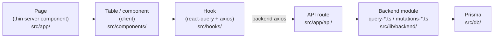
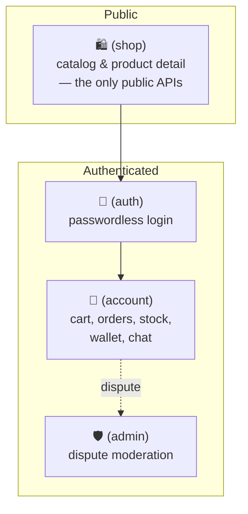

# Antigone documentation — start here

**Antigone is a marketplace for software license keys.** Two things make it unusual:

1. **You log in with a cryptographic key, not a password.** Your identity is a key pair derived in
   your browser from a seed phrase + passphrase; the server only ever knows your public key.
2. **Payments are held in a trustless escrow on Ark.** Ark is a Bitcoin layer-2 (Arkade is the
   implementation the app runs on); funds move as off-chain Ark transactions, anchored to Bitcoin.
   When you buy, the money is locked in an Ark contract that nobody — not the buyer, seller, admin, or
   the Arkade operator — can move alone. It is released to the seller on a happy trade, or split by an
   admin verdict on a dispute.

> **"On Ark" vs "on-chain".** Almost everything here happens _on Ark_ (layer-2): the escrow, payments,
> release, and dispute settlement are all Ark transactions. "On-chain" (Bitcoin layer-1) is reserved
> for the few things that genuinely touch L1: the unilateral CSV exit, onboarding/offboarding funds,
> and Lightning↔Ark swaps.

> **New to the domain vocabulary?** (VTXO, escrow leaf, the "13th word", checkpoint…) Start with the
> **[glossary](./glossary.md)** and keep it open in another tab.

## The main journey

This is the path most of the system serves, end to end. Each step links to where it is documented.

1. A visitor **browses the catalog** — public, no login. → [shop.md](./shop.md)
2. They **log in** by signing a server challenge with their key. → [auth.md](./auth.md)
3. They **add keys to the cart** (a 10-minute reservation) and **check out**. Checkout creates one
   **order per seller** and an **escrow** contract for each. → [account/orders.md](./account/orders.md)
4. They **pay** each escrow from their Arkade wallet. → [account.md](./account.md)
5. The **seller confirms** the order, which hands the buyer ownership of the keys, then buyer + seller
   - operator **collaboratively release** the funds to the seller. → [escrow/release.md](./escrow/release.md)
6. If something goes wrong, either side **opens a dispute**; the **admin rules** a verdict and the
   favoured party **settles** the escrow on Ark. → [escrow/dispute.md](./escrow/dispute.md) ·
   [admin.md](./admin.md)

The order and its escrow advance in parallel through this journey — the **state machine that ties them
together is the [lifecycle](./lifecycle.md)**, the best single page to understand the whole flow.

## How a request flows

Almost every feature follows the same path from page to database. Knowing this one shape makes the
codebase navigable:

Reads go through `query-*.ts`, writes through `mutations-*.ts`. Every write is **signed** in the
browser and verified server-side (see [crypto/signing.md](./crypto/signing.md)). Validation schemas in
`src/validators/` are shared by client and server.

## The four domains

The app is split into four route groups under `src/app/`, each with its own layout:

## Documentation map

The docs are organized in **3 levels**; each level adds detail and **does not repeat** the one above.

- **L1 — `CLAUDE.md`** (repo root): orientation, architectural synthesis, and `@docs/*.md` references
  to the L2 files. Always loaded.
- **L2 — domain & cross-cutting files in `docs/`**: pages, entities, the sub-flow map, and
  `resource → endpoint → backend` tables. Loaded on demand.
- **L3 — files in `docs/<area>/`**: the mechanics — algorithms, transactional steps, gates, edge
  cases. Referenced from their L2 parent.

### Domains (route groups of `src/app/`)

| Domain         | L2                         | L3                                                                                                                                                                |
| -------------- | -------------------------- | ----------------------------------------------------------------------------------------------------------------------------------------------------------------- |
| 🔐 `(auth)`    | [auth.md](./auth.md)       | [auth/flows.md](./auth/flows.md) · [auth/keys-vault.md](./auth/keys-vault.md)                                                                                     |
| 🛍️ `(shop)`    | [shop.md](./shop.md)       | —                                                                                                                                                                 |
| 💼 `(account)` | [account.md](./account.md) | [account/cart.md](./account/cart.md) · [account/orders.md](./account/orders.md) · [account/stocks.md](./account/stocks.md) · [account/chat.md](./account/chat.md) |
| 🛡️ `(admin)`   | [admin.md](./admin.md)     | —                                                                                                                                                                 |

### Cross-cutting (shared protocol, not tied to a single domain)

| Area             | L2                             | L3                                                                                                                                                                    |
| ---------------- | ------------------------------ | --------------------------------------------------------------------------------------------------------------------------------------------------------------------- |
| Arkade-OS escrow | [escrow.md](./escrow.md)       | [escrow/contract.md](./escrow/contract.md) · [escrow/release.md](./escrow/release.md) · [escrow/dispute.md](./escrow/dispute.md) · [escrow/fees.md](./escrow/fees.md) |
| Cryptography     | [crypto.md](./crypto.md)       | [crypto/signing.md](./crypto/signing.md) · [crypto/messaging.md](./crypto/messaging.md) · [crypto/at-rest.md](./crypto/at-rest.md)                                    |
| Data layer       | [data.md](./data.md)           | —                                                                                                                                                                     |
| Order lifecycle  | [lifecycle.md](./lifecycle.md) | —                                                                                                                                                                     |
| Glossary         | [glossary.md](./glossary.md)   | —                                                                                                                                                                     |

## Cross-cutting conventions

- **API auth**: protected routes use `requireSessionRoute()`; admin-only routes use
  `requireAdminRoute()` or a manual `session.user.isAdmin` check. → [crypto/signing.md](./crypto/signing.md).
- **Signed mutations**: every POST/PATCH/DELETE is signed by the client (`postSigned`) and verified by
  the server (`verifySignedJsonBody`); the envelope covers method + path + timestamp + nonce + payload.
  → [crypto/signing.md](./crypto/signing.md).
- **Validation**: Zod schemas shared between client and server in `src/validators/index.ts`.
- **Prices**: in satoshi (integers). Always use `formatPrice()` from `src/lib/utils.ts`.
- **UI strings**: English only.

## "Feature under development" convention

While building a complex feature, expand its L3 into numbered sub-files (`00-overview.md`, `01-…`)
with specs, types, and detailed instructions. Once the feature is stable, **condense** everything back
into the parent file and **remove** the sub-files: detailed docs while you need them, zero token cost
once they stabilize. (No feature under active development at the moment.)
