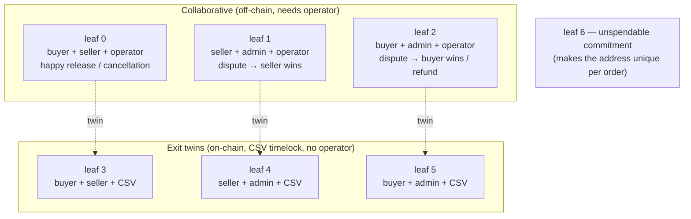

# The escrow contract

## What it is

The escrow is a **Bitcoin address that can only be spent in a few pre-agreed ways**. Each "way" is a
branch — a **leaf** — of a _taproot tree_. Taproot lets all the branches coexist in one address while
revealing only the branch actually used. The tree is built by `buildEscrowVtxoScript`
(`src/lib/ark/escrow.ts`).

There are **6 spend paths** plus **1 unspendable leaf** (7 total). The 6 paths are the same for every
order; the 7th leaf is what makes each order's address unique (explained below).

## Collaborative vs exit paths

Arkade has one rule that explains the whole layout:

- A **collaborative** spend (off-chain, instant) **must include the operator** as a co-signer.
- An **exit** spend (on-chain, the fallback if the operator disappears or censors) **must use a CSV
  timelock** (`unilateralExitDelay`) and **must not** include the operator.

So every collaborative path has a CSV "twin" — the same parties, minus the operator, plus a timelock.
The timelock ensures the instant collaborative path always wins in practice, and the exit only becomes
spendable if the operator is absent.

## The 6 spend paths

1. `buyer + seller + operator` — happy release / consensual cancellation.
2. `seller + admin + operator` — dispute resolved in favour of the **seller**.
3. `buyer + admin + operator` — dispute resolved in favour of the **buyer** / refund.
4. `buyer + seller` + CSV — exit twin of path 1.
5. `seller + admin` + CSV — exit twin of path 2.
6. `buyer + admin` + CSV — exit twin of path 3.

> A **partial refund** (`partially_refunded`) needs no dedicated path: paths 2/3 (or 5/6) can build a
> transaction with multiple outputs, and the party that only receives funds does not sign.

## The 7th leaf (unique address per order)

**Why it exists.** Without it, two checkouts between the same buyer and seller (same admin, operator,
exit delay) would produce the **same** escrow address — making escrows ambiguous to tell apart.
The 7th leaf injects a per-order random value into the tree so **every order gets its own address**,
while the 6 real spend paths stay byte-for-byte identical (`findLeaf` and the collaborative signatures
work unchanged).

**Why it's unspendable.** The leaf commits to a point `commitment = NUMS + sha256(nonce)·G`, where
`NUMS` is the standard taproot "nothing-up-my-sleeve" key whose private key is unknown by
construction. Because nobody knows the discrete log of `NUMS`, nobody can sign for `commitment` —
**not even** someone who knows the nonce (which is **public**; it is shared with the client to
re-derive the address).

**Why it still validates.** The leaf is wrapped as a 2-of-2 multisig `[commitment, server]`. Arkade
requires a non-CSV closure to contain the operator's signer pubkey (otherwise `submitTx` is rejected:
`INVALID_VTXO_SCRIPT … invalid forfeit closure, signer pubkey not found`). Including `server`
satisfies that rule, while the `commitment` key keeps the leaf permanently unspendable.

## The per-order nonce

The server generates **32 random bytes** (CSPRNG, `crypto.randomBytes`) before deriving the address,
stores them on `Escrow.nonce` (NOT NULL), and returns them in the `EscrowDescriptor` to the client.
The client needs the nonce to re-derive the same address before paying; on release,
`escrowParamsFrom` (`orders.ts`) feeds it back into `buildEscrowVtxoScript` to rebuild the correct
tree.

## Address derivation

Before the checkout transaction, the route (`src/app/api/cart/checkout/route.ts`) gathers the escrow's
inputs:

- the **operator's** pubkey + `hrp` + `unilateralExitDelay`, via `getArkOperatorConfig()` (a memoized
  network call, `src/lib/ark/operator.ts`);
- the **admin** pubkey, derived from `ADMIN_MNEMONIC` + `ADMIN_PASSPHRASE` (the admin `Account` is
  `upsert`ed so `Escrow.arbiterPubkey` has a row to reference) — missing `ADMIN_MNEMONIC` → 500;
- `exitDelay` (the raw `unilateralExitDelay`, used as the CSV timelock on the exit paths).

The address itself is computed by `deriveEscrowAddress()`. The escrow ↔ order link lives **only** on
`Order.escrowAddress`; keys stay attached via `Key.orderId` (there is no escrow field on `Key`).

## Client-side verification

After checkout, `useCheckout` (`src/hooks/cart.ts`) **recomputes** each escrow address locally with the
**same** `deriveEscrowAddress()`, using the `exitDelay` and `nonce` the server returned. If the
recomputed address doesn't match the server's, it throws and **blocks the payment** — so a tampered or
buggy server response can't redirect the buyer's funds.
