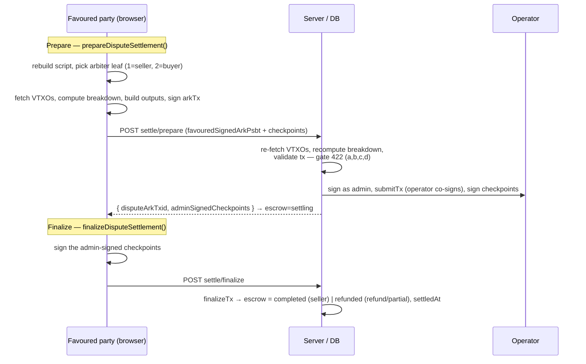

# Dispute settlement

When the buyer and seller disagree, the **admin is the tie-breaker** — but the admin still **cannot
take the money alone**. The admin only _authorizes_ an outcome: they pick which of two arbiter paths
may be used (seller wins, or buyer wins/refund) and co-sign it server-side. The actual settlement (an
Ark transaction) is driven by the **favoured party** — the side the admin ruled for. The other side
does nothing.

So a funded dispute settles in two halves:

1. The admin records a **verdict** (`concludeOrderAsAdmin`: who is favoured, how much is refunded) —
   see [admin.md](../admin.md). This does not move funds.
2. The favoured party **settles on Ark** using the arbiter leaf (1 or 2), in a prepare → finalize
   pair, with the admin co-signing server-side.

For the leaves see [contract.md](./contract.md); for the money breakdown see [fees.md](./fees.md).

## Opening a dispute — `openDispute()`

Buyer or seller, while the order is not terminal. It moves the order → `disputed`, the escrow →
`disputed` (unless already `completed`), and ensures the chat is open. Resolution is then the admin's.

## Settlement (arbiter leaf 1/2)

**Prepare — `prepareDisputeSettlement()`** (favoured party):

1. The client rebuilds the escrow script via `buildEscrowVtxoScript`.
2. It selects the arbiter leaf from the admin's `favouredRole`: **leaf 1** (`seller + admin + operator`)
   if the seller was favoured, **leaf 2** (`buyer + admin + operator`) if the buyer was. (Orders
   concluded before `favouredRole` existed fall back to the legacy mapping: outcome `completed` →
   seller, otherwise buyer.)
3. It fetches the spendable VTXOs at the escrow address and computes `lockedTotal` (sum of the spent
   VTXOs).
4. It computes the breakdown via `computeDisputeBreakdown({ ...verdict, lockedTotal })` — any
   overfunding surplus goes back to the buyer — and builds the outputs with `buildDisputeOutputs`
   (amounts from the breakdown; pkScripts via `deriveRecipientPkScript` / the favoured party's own ark
   address).
5. It signs the arkTx with its own key → `favouredSignedArkPsbt` + checkpoint PSBTs.
6. `POST /api/orders/[id]/settle/prepare`: the server fetches the VTXOs once
   (`getEscrowVtxoSet` → outpoints + `lockedTotal`), **recomputes** the breakdown with the same
   `lockedTotal`, and validates the tx with the shared gates (`src/lib/ark/tx-validation.ts`, gate 422,
   via `Transaction.fromPSBT` — not a hand-rolled byte parser):
   - **(a)** every **checkpoint** spends only VTXOs of _this_ escrow (checkpoint inputs are the real
     VTXOs, not the arkTx);
   - **(b)** every input of the **arkTx** is one of the supplied checkpoints (binding, so the outputs
     can't be paired with another escrow's checkpoints);
   - **(c)** the **outputs** match the verdict (set + amounts);
   - **(d)** value is conserved (sum of outputs == total).

   Then it signs the arkTx as **admin**, calls `submitTx` (the operator co-signs), signs the
   checkpoints as admin, persists everything, and moves the escrow to `settling`. Returns
   `{ disputeArkTxid, adminSignedCheckpoints }`.

**Finalize — `finalizeDisputeSettlement()`** (favoured party):

1. The client signs the admin-signed checkpoints (`finalizeDisputeAsFavoured`).
2. `POST /api/orders/[id]/settle/finalize`: the server runs `finalizeTx` and moves the escrow to
   `completed` (favoured = seller) or `refunded` (refund / partial), stamping `settledAt`.

The UI folds both into one **"Settle and complete"** action (`useSettleDispute`: `settle/prepare` then
`settle/finalize`, with `adminSignedCheckpoints` carried over from the prepare response).

## Cryptographic guarantee

The Schnorr signature covers the **entire** transaction, outputs included. The server validates the
inputs (bound to this escrow's VTXOs through the checkpoints) and the outputs **before** signing as
admin (gate 422). Without the admin signature the operator won't co-sign, so a transaction with
tampered inputs or outputs can never be spent on leaf 1/2. And the admin alone is not enough either:
the **favoured party's signature is required** — the admin can authorize an outcome, not seize the
money.

## CSV exit (Stage 2 — not implemented)

The "Exit unilaterally (CSV)" button is visible but **disabled**, and `/settle/exit` responds **501**.
A unilateral exit needs an on-chain provider, funds for the mining fee, and `Unroll.Session` to unroll
the VTXO tree.
