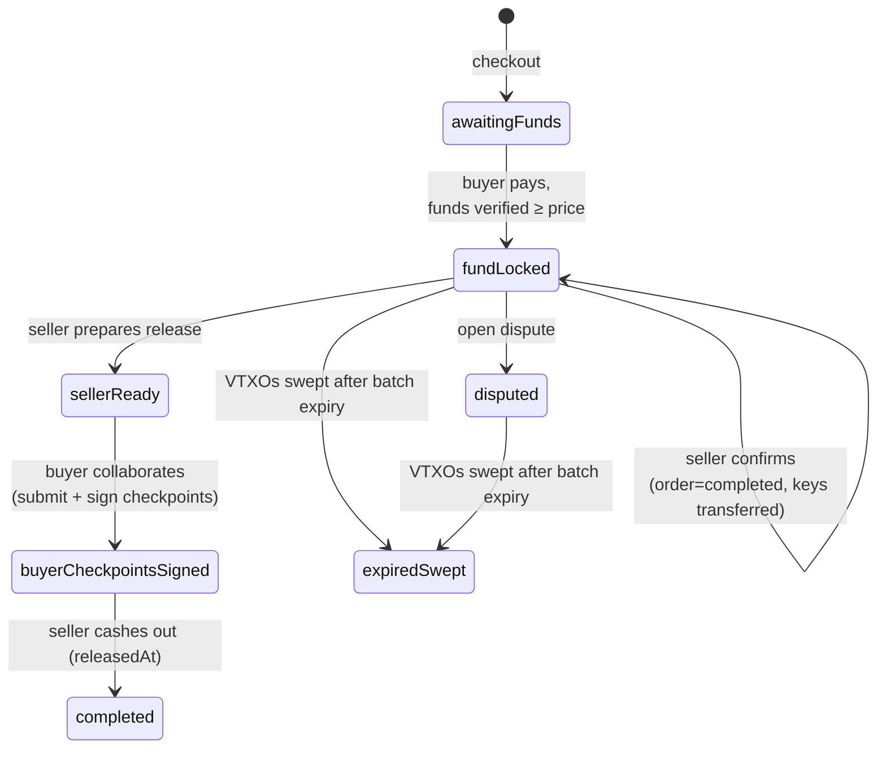
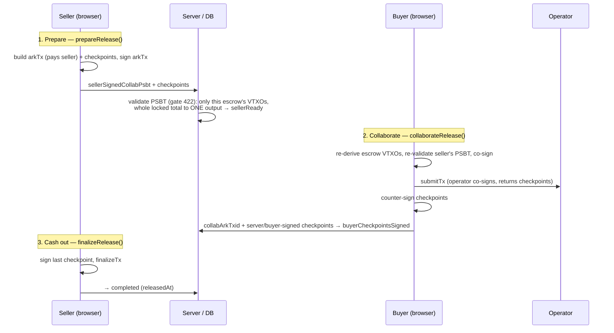

# Release

The happy path, when nothing goes wrong. The trade completes like this:

1. The buyer **pays** the escrow address. The system **verifies** the funds (VTXOs) actually arrived
   at the escrow address.
2. The **seller confirms** the order — this hands the buyer ownership of the keys.
3. The buyer and seller, together with the operator, **co-sign one transaction** that pays the funds to
   the seller. Because their two browser-held keys are never online at the same time, this is relayed
   through the database in three signed steps.

The contract and its leaves are in [contract.md](./contract.md); disputes in [dispute.md](./dispute.md);
the fee split in [fees.md](./fees.md).

## Escrow status

(The `disputed → settling → completed/refunded` half is in [dispute.md](./dispute.md).)

## Funding verification

The escrow's funds are **VTXOs** (Arkade's off-chain equivalent of UTXOs) at the escrow address. The
system has to confirm enough of them are there before trusting the payment.

- **`verifyEscrowFunding()`** (`mutations-orders.ts`) queries the Arkade indexer
  (`getEscrowVtxoSet`/`getEscrowFunding`, `src/lib/ark/funding.ts`). If the locked VTXOs cover the
  `price`, it moves the escrow to `fundLocked` and stamps `fundedAt`. It is **idempotent** and callable
  by either party. It also detects a **sweep**: if the escrow was funded but its VTXOs have since
  disappeared while still in `fundLocked`/`disputed`, it marks the escrow `expiredSwept`.
- **`readEscrowFunding()`** (`query-orders.ts`) is the **read-only** variant — it never mutates state.
  It returns `{ total, price, funded, expiresAt, expirySoon, swept }` (the time fields computed with
  the authoritative server clock) and feeds the **funding bar** (`EscrowFundingBar`) shown in the order
  detail and the admin dispute detail ("X of Y sats locked / Z missing", expiry warning, sweep signal).

**Polling and auto-lock.** `useEscrowFunding` polls every **8s** while pre-lock
(`awaitingFunds`/`partiallyFunded`) and every **60s** while locked-but-not-terminal
(`fundLocked`/`sellerReady`/`buyerCheckpointsSigned`/`disputed`/`settling`), stopping on terminal
states. When polling reports `funded` but the state is still pre-lock, the client **automatically**
calls `verify-funding` (the "Verify payment" button remains as a manual fallback).

> **Why funds can expire (the batch-expiry sweep).** VTXOs expire at the Arkade **batch expiry**, and
> there is no escrow renewal (that would need buyer and seller online together), so a trade **must
> resolve before the expiry** (~3-day window). `verifyEscrowFunding` marks `expiredSwept` (terminal)
> when a funded escrow's VTXOs are gone and the state is still `fundLocked`/`disputed` — **not**
> `sellerReady`/`settling`, where a legitimate spend may be mid-flight. The funding bar warns as the
> expiry approaches (`expirySoon`/`expiresAt`).

## Seller confirmation — `confirmOrder()`

Seller only. Guard: the escrow must be `fundLocked` (it verifies the funding inline if needed). Then
`Key.updateMany` sets `buyerPubkey` on every key — **this is the transfer of ownership** — and the
order moves to `completed`.

> Before confirmation the key has an `orderId` but **no `buyerPubkey`**: ownership passes only here.
> This is why a buyer who paid but whose order isn't confirmed yet still sees `—` for the key code.

## Collaborative release (leaf 0: buyer + seller + operator)

The buyer's and seller's keys live only in their respective browsers and are **never online together**,
so the spend is relayed through the DB in three signed steps. All the cryptography (build/sign/submit/
finalize) happens **client-side** in `src/lib/ark/release.ts`; the mutations only persist the PSBTs and
advance the state.

1. **Prepare — `prepareRelease()`** (seller): `buildOffchainTx` builds the arkTx (one output to the
   seller's ark address) plus the checkpoints; the seller signs the arkTx →
   `escrow.sellerSignedCollabPsbt` + `releaseCheckpointPsbts`, state `sellerReady`. Before persisting,
   the server runs the shared validation gates (`src/lib/ark/tx-validation.ts`): the tx spends **only
   this escrow's VTXOs** and pays the **entire locked total to one output** (gate 422).
2. **Collaborate — `collaborateRelease()`** (buyer): the buyer **verifies** the seller's PSBT before
   co-signing (`submitAndSignAsBuyer` re-derives the escrow's VTXOs and applies the same gates — only
   this escrow's funds, payout = locked total; the recipient pkScript is not constrained, but on the
   happy path the only valid outcome is "everything to the seller"). The buyer adds their signature,
   submits to the operator (`submitTx`, which co-signs and returns the checkpoints), and counter-signs
   the checkpoints → `collabArkTxid` + `serverSignedCheckpoints` + `buyerSignedCheckpoints`, state
   `buyerCheckpointsSigned`.
3. **Cash out — `finalizeRelease()`** (seller): signs the final checkpoint and runs `finalizeTx`,
   releasing the funds to itself → state `completed`, `releasedAt`.

## Polling and combined actions

`useOrderDetail` polls every **10s** while the order is active and stops on terminal states (escrow
`completed`/`refunded`, or order `cancelled`/`refunded`); the lists (`useOrders`) poll every 15s, the
chat (`useChat`) every 10s while open — so each party sees the counterparty's moves without reloading.

The `OrderStepper` makes the state readable and joins the sequential steps into single buttons: on
`fundLocked` the seller uses **"Confirm and prepare release"** (`useConfirmAndPrepareRelease`: `confirm`
then `release/prepare`); on a concluded dispute the favoured party uses **"Settle and complete"**
(`useSettleDispute`, see [dispute.md](./dispute.md)). If the second step fails, the escrow stays in the
intermediate state and the button for the remaining step reappears as a fallback after the refetch.
