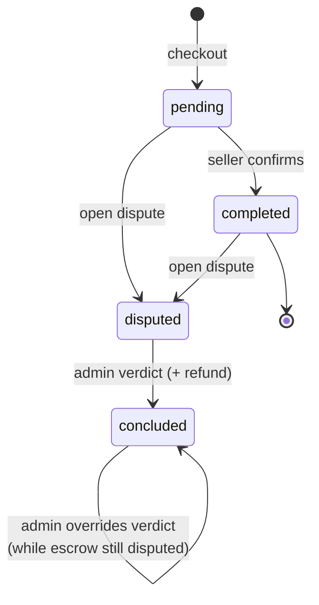
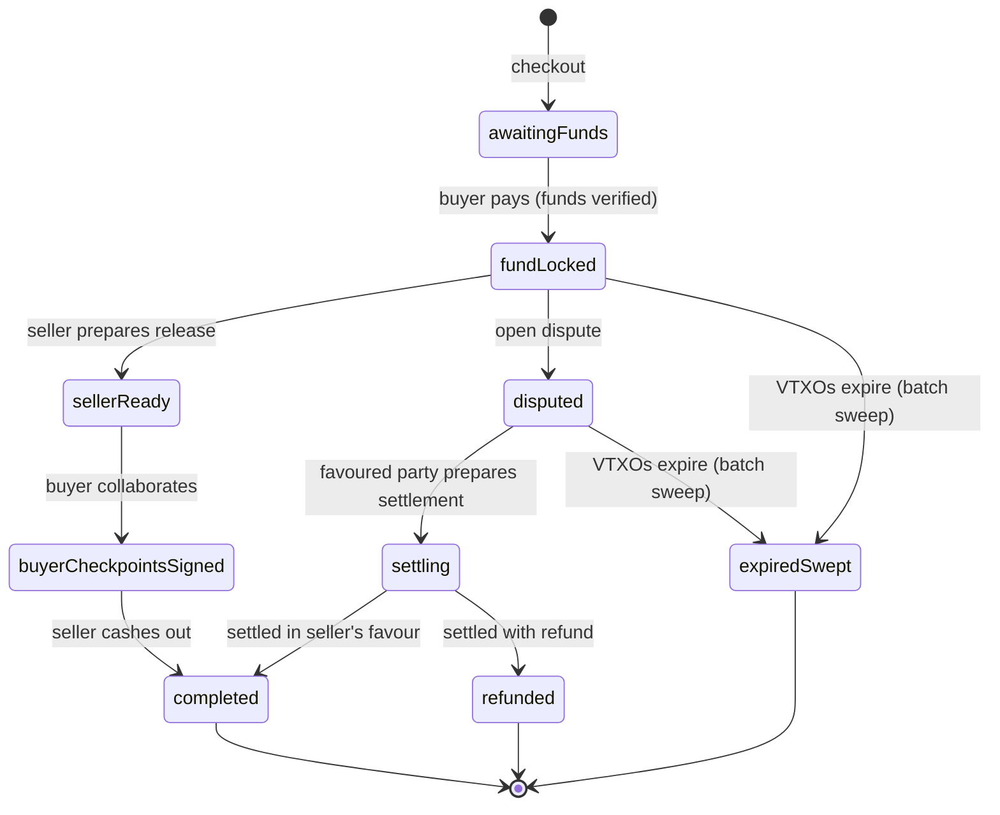

# Order lifecycle

This is the spine of the whole system: how a trade moves from "in the cart" to "done." If you read one
page to understand Antigone, read this one. It is also the **single source of truth** for which state
transitions are actually wired today (the underlying Ark mechanics behind them live in
[escrow/release.md](./escrow/release.md) and [escrow/dispute.md](./escrow/dispute.md)).

## Two records in parallel

Every trade is tracked by **two** records that advance together:

- The **order** is the trade as the user sees it — pending, completed, disputed, and so on.
- The **escrow** is where the money actually is — waiting for funds, funds locked, released, refunded.

They are kept separate because the user-facing status and the actual movement of funds can diverge: an
order can be `concluded` (the admin has ruled) while its escrow is still `disputed` (the funds haven't
been moved on Ark yet). When in doubt about "where are the funds?", look at the **escrow** status.

## Order states

Defined in `src/db/enums.ts` (`orderStatusValues`):
`pending · funded · completed · disputed · refunded · cancelled · concluded`.

> **Heads-up — residual states.** `funded` and `refunded` exist in the enum but are **no longer used**
> at the order level; funding is tracked on the escrow now (see below). Don't be misled by them.

The transitions actually wired today:

The conclusion is **not terminal at the order level**: as long as the escrow stays `disputed` (the
Ark settlement is still pending), the admin can re-conclude and override the verdict — for
example to change the favoured party. The verdict is only fixed once the escrow becomes terminal. The
**chat** follows the escrow, not the order: it stays open as long as the escrow is unsettled (closed
by `concludeOrderAsAdmin` only if the escrow was never funded, otherwise by
`finalizeDisputeSettlement`).

## Escrow states

`escrow.status` (`escrowStatusValues`) tracks funding and Ark settlement:

- **Happy path** (`awaitingFunds` … `completed`): detail in [escrow/release.md](./escrow/release.md).
- **Dispute** (`disputed` … `refunded`): detail in [escrow/dispute.md](./escrow/dispute.md).
- **Sweep** (`expiredSwept`, terminal): the escrow's VTXOs expire at the Arkade batch expiry and are
  swept — the locked funds are no longer recoverable (not even via a unilateral exit). See
  [escrow/release.md](./escrow/release.md).

> **Heads-up — residual states.** `partiallyFunded` and `buyerSubmitted` exist in `escrowStatusValues`
> but the wired transitions never set them (they are only read in a few conditionals). The real
> transitions are the ones in the diagram above.

## Order ↔ escrow mapping

How the two records line up at each milestone:

| Milestone         | Order       | Escrow                                                                         |
| ----------------- | ----------- | ------------------------------------------------------------------------------ |
| Checkout          | `pending`   | `awaitingFunds`                                                                |
| Seller confirms   | `completed` | `fundLocked` (until the release starts)                                        |
| Dispute concluded | `concluded` | stays `disputed` if funded (settlement pending); else `completed` / `refunded` |
